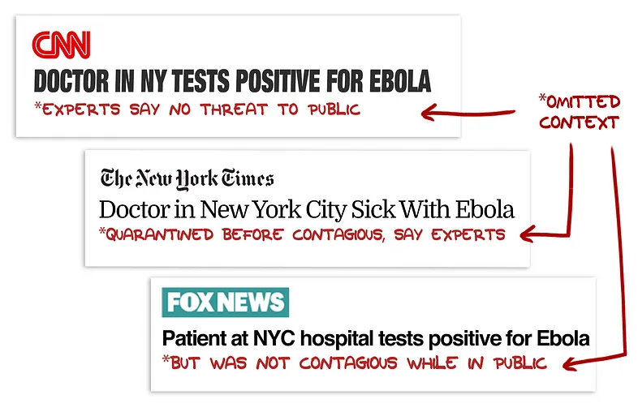
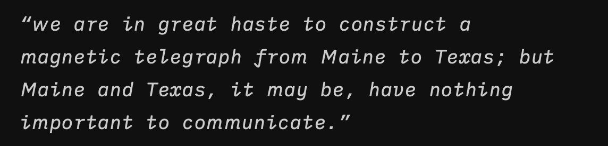

## Mind & Spirit



> We hope to find meaning by fitting ourselves into some ready-made story about the universe, but according to the liberal interpretation of the world, the truth is exactly the opposite. The universe does not give me meaning. I give meaning to the universe. This is my cosmic vocation. I have no fixed destiny or dharma.\
> \
> _-21 Lessons for the 21st Century, Yuval Noah Harari_

> Abuse and neglect negate love.
> \
> _- What It Takes to Heal, Prentis Hemphill_
<--->
> Eventually, striving to improve yourself brings diminishing returns and prevents you from accepting yourself and living with what you’ve got.\
> \
> _-F*ck Feelings, Michael Bennett MD, Sarah Bennett_




<--->
> People don’t succumb to screens because they’re lazy, but instead because billions of dollars have been invested to make this outcome inevitable.\
> \
> _-Cal Newport, Deep Work_





> “If old truths are to retain their hold on men’s minds, they must be restated in the language and concepts of successive generations”\
> \
> _-Steven Pinker, Enlightenment Now_



## Focus

## Tech and Equity

> In order to cope with the unprecedented technological and economic disruptions of the twenty-first century, we need to develop new social and economic models as soon as possible. These models should be guided by the principle of protecting humans rather than jobs.\
> \
>_-21 Lessons for the 21st Century, Yuval Noah Harari_