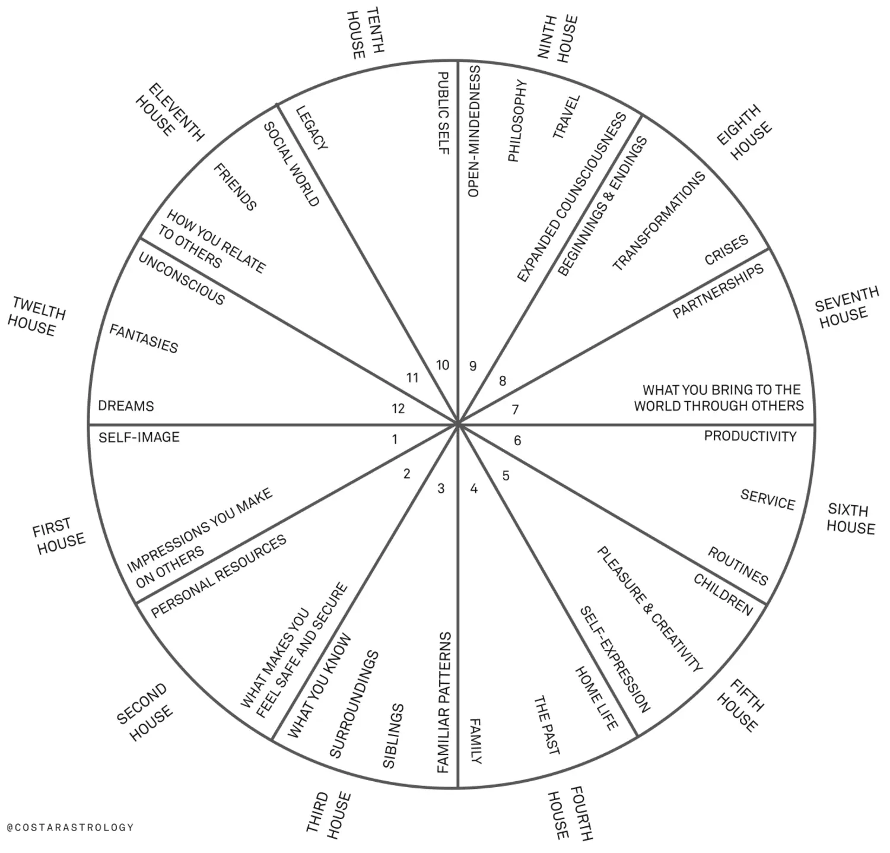
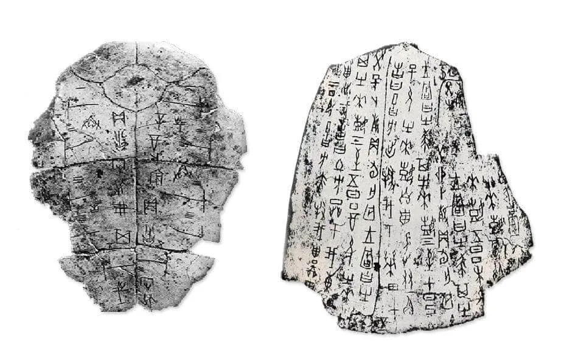

I'm interested in how people try to make sense and gain insight about themselves, their lives and the world around them via outside patterns. Tarot and astrology are certainly two of the most accessible ways of doing that, but other things such as I Ching, palmistry, and other folk beliefs hold fascination.

Is this stuff real, you wonder? Who knows, I suppose it is if you believe it to be so. That doesn't interest me so much as how the act of focusing on these systems elicits insight about a particular part of your life. 

Say you are looking to make a big move in life, but are stuck on what to do. What if you pulled a Tarot card and thought about it for a moment? Maybe you spot something unexpected on it—a look on someone's face, a detail—that sparks a new approach to your question. Maybe that leads to the insight you needed.

That such tangential thinking can help you sidle up to a real solution that might've been eluding you is really the notion which holds my attention.

But also, they're fun.

## Astrology 

| House  |  Description |
|:----|:--|
|1st house  | Self-image, the impressions you make on others |
|2nd house  | Your personal resources, what makes you feel safe and secure |
|3rd house  | What you know and your everyday surroundings, including siblings and familiar patterns |
|4th house  | Home life, family, close relationships, the past and its effect on you |
|5th house  | Pleasure & creativity, self-expression, fun, children |
|6th house  | Productivity, service, routines |
|7th house  | Partnership and committed relationships, what you bring into your world through other people |
|8th house  | How you relate to other people’s resources and things out of your control, including beginnings and endings, transformations, crises |
|9th house 	| Open-mindedness, philosophy, exchange of culture and ideas, expanded consciousness, travel |
|10th House | Your public self and commitments, career, how you wanted to be remembered, your legacy |
|11th House | Your social world, friends & acquaintances, how you relate to groups of people |
|12th House | Your unconscious, dreams, fantasies |

## Scapulimancy

After watching [The Story of China](https://www.pbs.org/video/discovery-first-chinese-writing-0nuw50/) to fill some gaps in my world history knowledge, I caught a segment on reading "dragon bones." This is actually how historians uncovered the earliest form writing in China: they found burned animal bones with characters scratched onto them from the Shang Dynasty.

In this method of divination, holes were burned in one side of a bone with the intent to fracture the other side and give the reader an answer to a question. Questions like "will it rain" or "will our enemies attack" were common.

Further reading from JSTOR: [How to Read the Bones Like a Scapulimancer](https://daily.jstor.org/how-to-read-bones-like-a-scapulimancer/)