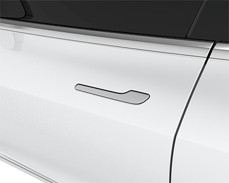

## Tech
Abandoned the search engine project. It was too difficult to diagnose issues with the experience I had. Also the instructions had a lot of assumed knowledge but that’s not impossible to address. 

## Reading
Finished Salem’s Lot, and liked it. Most of the book was chatter about small town goings-on and a slow starter. King’s prose is still wonderful, and I highlighted so many beautiful sentences. The book seemed to have some inconsistencies with how vampires worked in the world (they were padlocked inside their resting places?) but that didn’t stop me from enjoying it. 

## Design
I’m resonating pretty deeply with [this site and its ethos](https://normadesign.it/en/). The only path I see forward for Design is in directly focusing on problem definition, approach, and generating responses to said problems. There will always be the need to tweak visuals and obsess over typography, but UI design is dead. 

Material and iOS (to a lesser extent) own UI design now. We may still create novel solutions to problems, but most design patterns have been discovered already. I do think that it’ll be most sites and apps looking the same now. It isn’t always a bad thing, cars are standardized, and we like that. And when we deviate from standards, it causes a lot of confusion. See: Tesla door handles. Anything requiring an animated explainer already has it wrong. 

