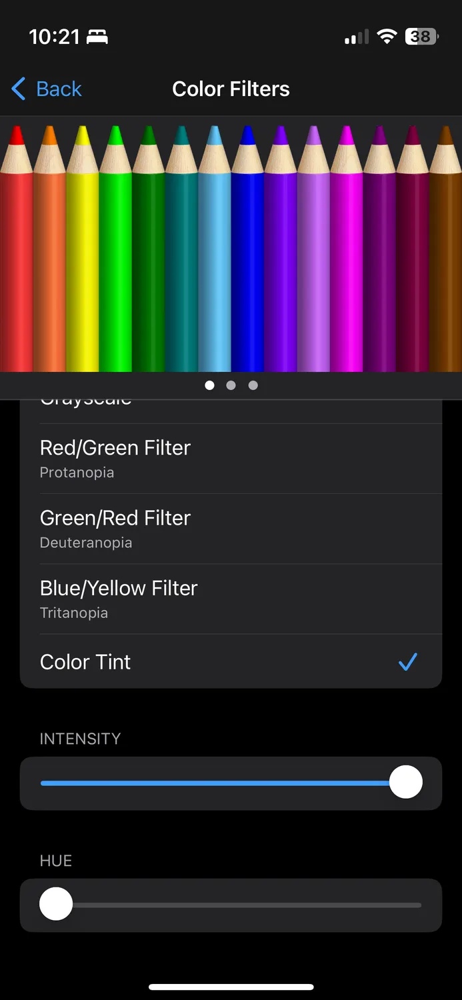

My favorite time of year is here. Hooray for spooky season! I updated the site with spooky Halloween colors, too.

## Red mode on iPhone

I've been trying to make reading on my phone as easy as I can, and I remember working in the darkroom a lot in college. It was easy to see in there with a red light and didn't hurt my eyes. I thought I'd see if iOS had the ability to do this, given that it lets you go greyscale and filters other colors. It does, turns out. This, plus reducing the white point makes evening browsing less stressful on your eyes.

Head to your Accessibility Settings and it's in the Display / Color Filters section.
<--->


## Sustainability
New from [Futurism](https://futurism.com/critics-microsoft-water-train-ai-drought) in how Microsoft and others are using billions of gallons of water to train AI. 
> Microsoft increased worldwide water consumption by a whopping 34 percent — up to almost 1.7 billion gallons annually — last year, which outside researchers told the AP is most likely due to increased AI training. That's dwarfed by Google, which used 5.6 billion gallons last year, a 20 percent jump that's also likely attributable to machine learning. And you'll recall that ChatGPT wasn't even publicly released until the end of November, with AI use spiking enormously this year — so those figures are likely only the tip of the iceberg.

Speaking of AI, thanks for this `robots.txt` file to block AI site scrapers, [Neil Clark](https://neil-clarke.com/block-the-bots-that-feed-ai-models-by-scraping-your-website/)! I’m not approving any such bot to scrape my site. 

```

User-agent: CCBot
Disallow: /

User-agent: ChatGPT-User
Disallow: /

User-agent: GPTBot
Disallow: /

User-agent: Google-Extended
Disallow: /

User-agent: Omgilibot
Disallow: /

User-agent: Omgili
Disallow: /

User-agent: FacebookBot
Disallow: /

```