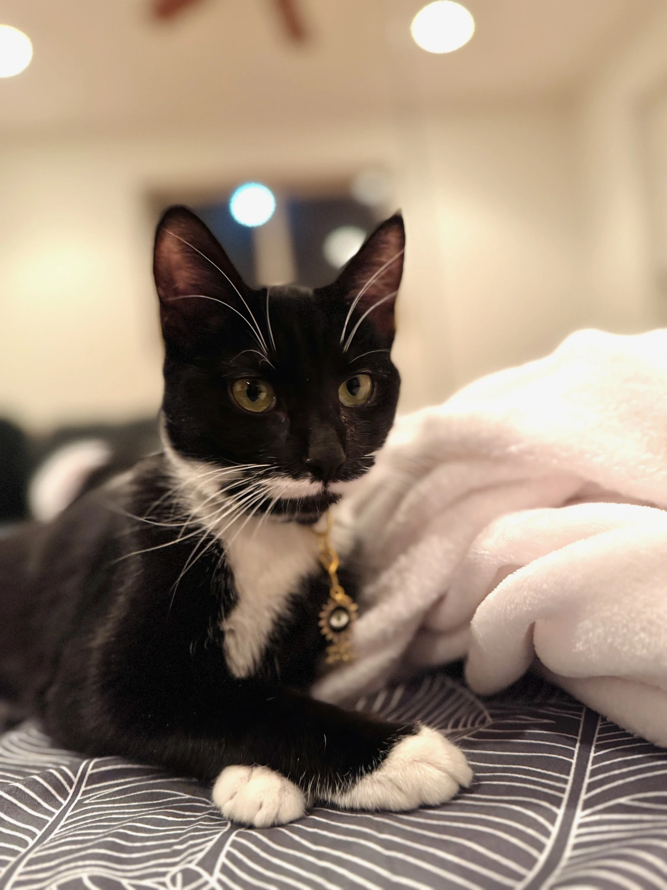

I spent the last year living in Joshua Tree, CA. It was wonderful. The landscape is incredible, the energy invigorating. But now I’m splitting my time between there and somewhere else. So it’s as if I have two homes now.

I adopted a perfect little tuxedo cat who is so very sweet to me. I had heart eyes when I held her for the first time. It’s been over a year since I’ve had pets in my life, and I’m so happy they’re back.

[My book](/we-need-to-talk) is scheduled to be in production this week. It’s been five years in the writing, about 8 since I developed an interest in it. I’ve wanted to see this book, this type of kindness-forward thinking, in the world for years. It can change how we relate to each other for the better, and I think it’s part of my life’s work.

I’m also developing a sitting practice. I made it 10 days after a silent retreat over the new year. Having time for me to empty my mind and sit quietly for a while has been illuminating for my inner world. I don’t subscribe to the notion that you must sit quietly and just zen out, there are a number of things to do that fall under the umbrella of mindfulness—I encourage anyone reading this to be skeptical of those who push a certain method of mindfulness as the be-all-end-all and do what feels kind to yourself.