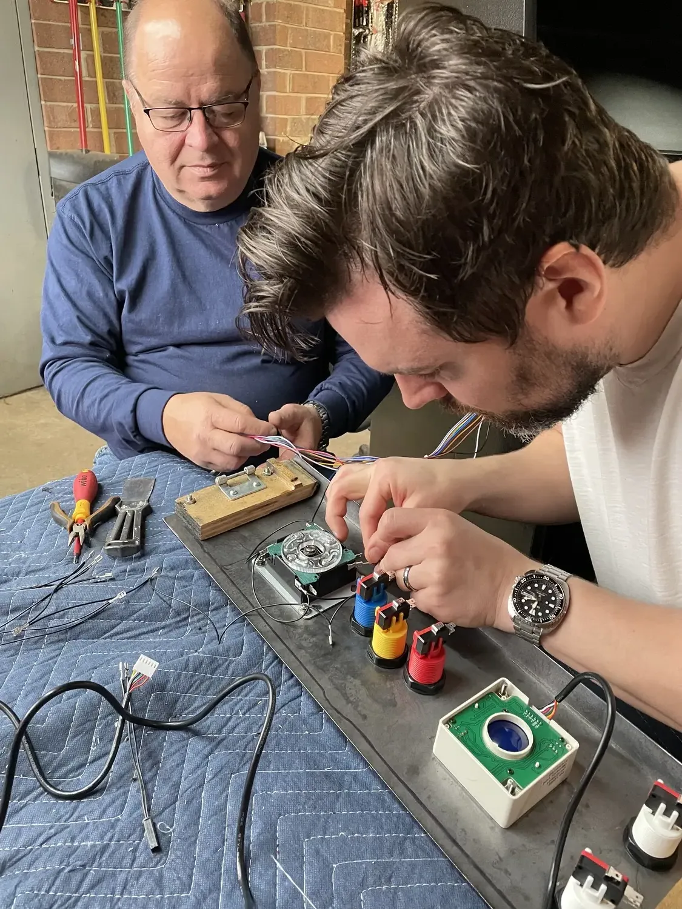
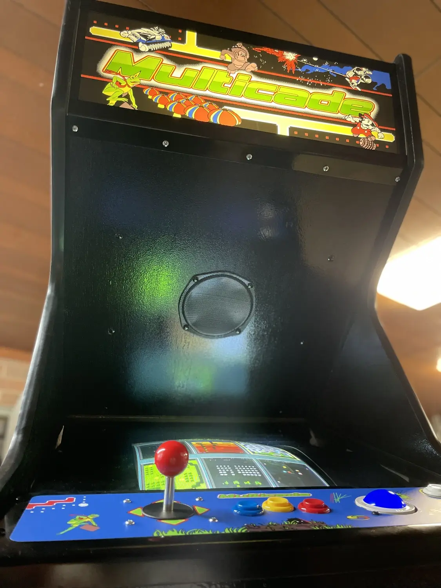
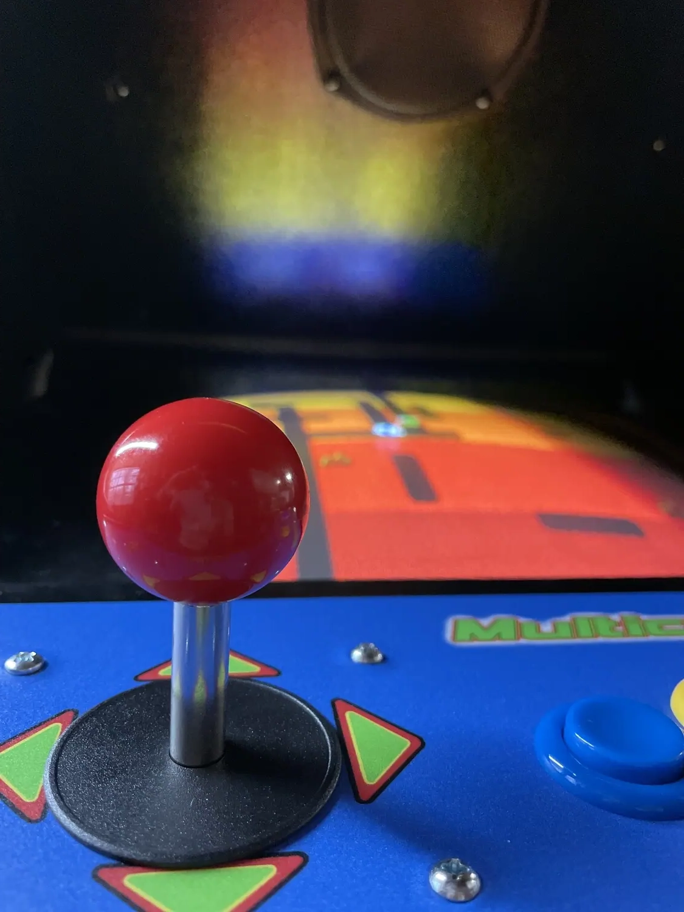
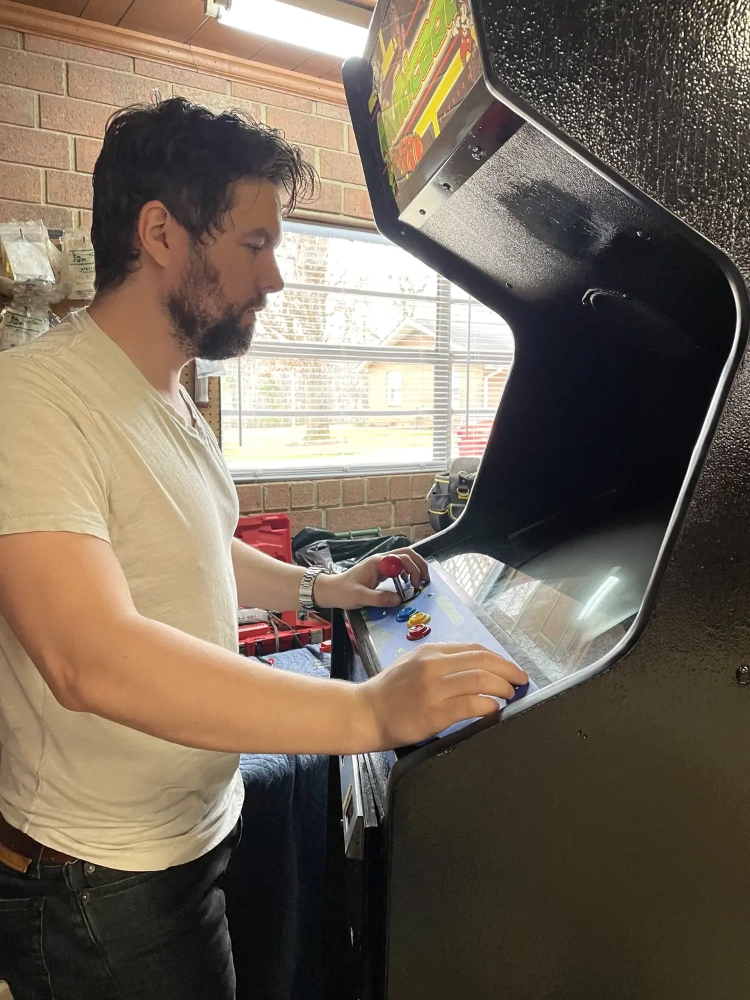
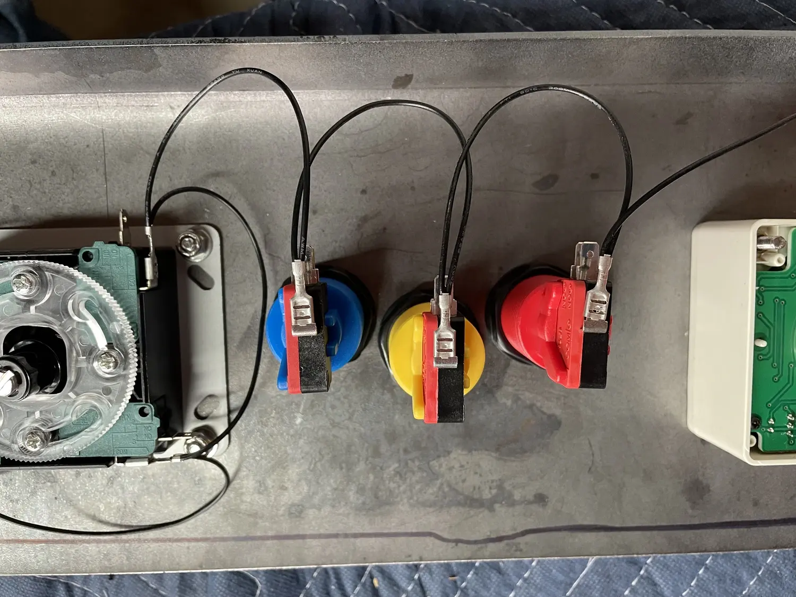
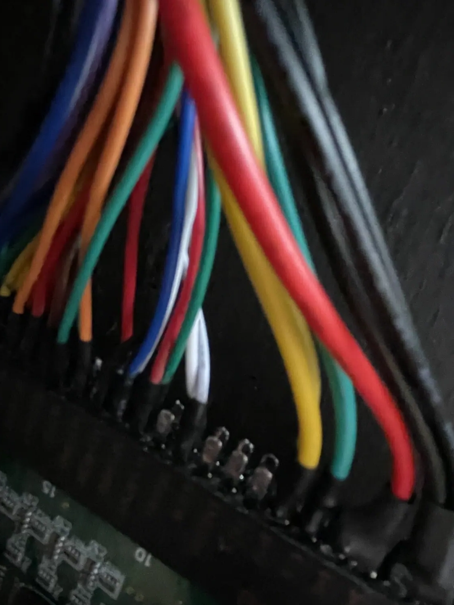
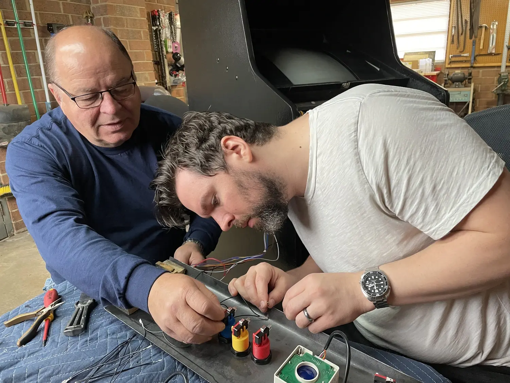
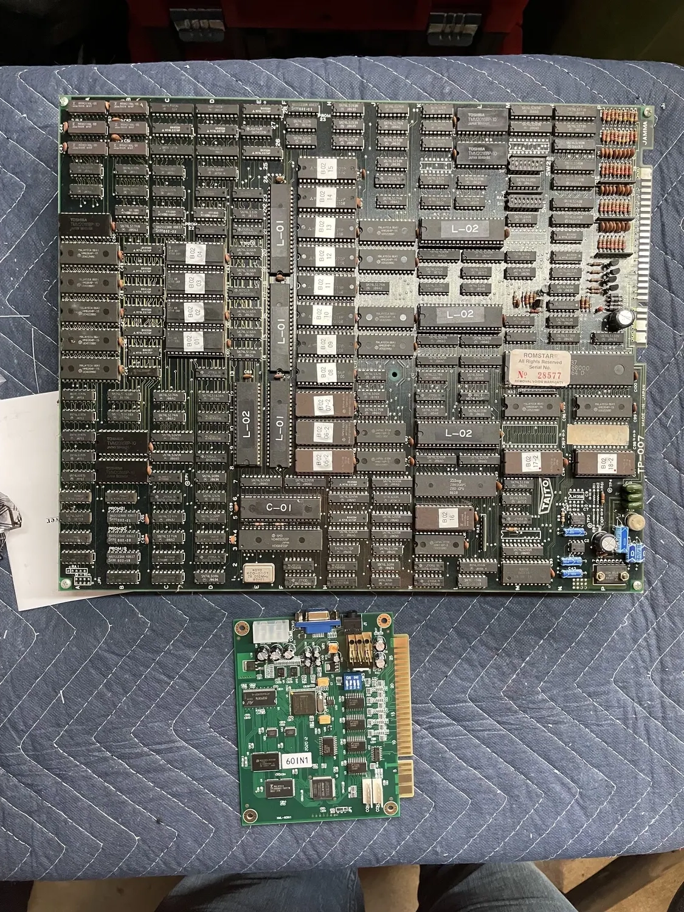
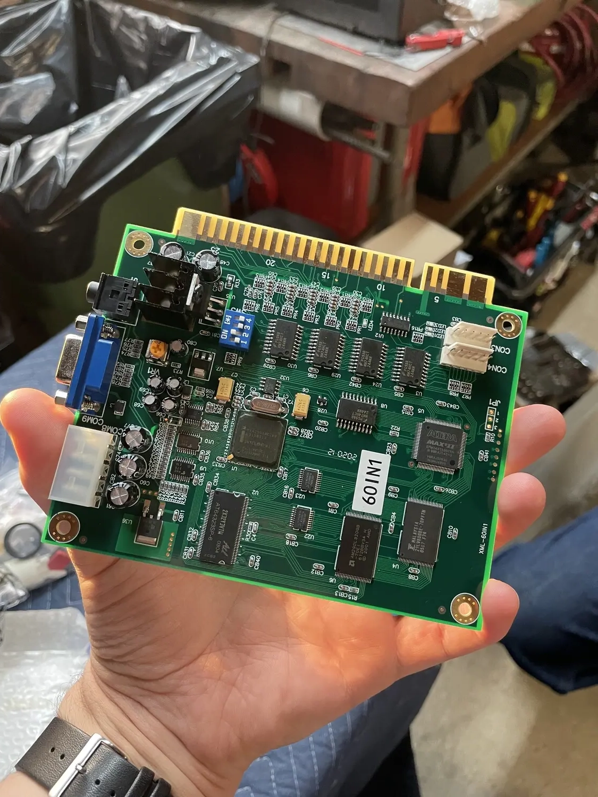

My dad and I fixed up an old, junked arcade cabinet, complete with giant CRT monitor, and put in a multicade game board.

It was not the easiest project (we also had to bend steel for the play field where the joysticks and buttons are!), but it was so rewarding.



<--->





<--->




<--->

<--->





<--->

