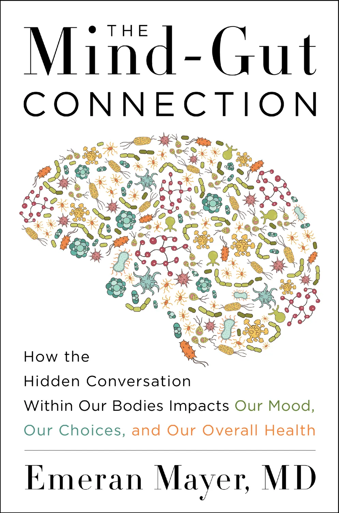

{}

{}

## Film


<--->

<--->





<--->

<--->



## Fiction


<--->

<--->



## Non-Fiction


<--->

<--->

<--->


{}

{}

## Weirdest
**Possession**
: Most unexpected squid pro quo in cinematic history.

## Best Soundtrack
**It Follows**
: My synthwave obsession started here.

**A Girl Walks Home Alone at Night**
: If I've gotta die, I want it to be to this soundtrack.

## Most Surprising
**Bones and All**
: Surprisingly easy to stomach.

**Titane**
: Hear me out, Rosemary's baby, but a car.

## Comforting
**The Big Lebowski**
: Yes, that’s like, my opinion, man.

**Addams Family**
: If your relationship goals aren’t Morticia and Gomez, then please rethink your life.

**Shaun of the Dead**
: Needs no further explanation.

## Vibes
**Atomic Blonde**
: HEALTH's Blue Monday cover is as good as the original, and I will accept no counter arguments.

**The Hunger**
: David Bowie as a vampire plus Peter Murphy doing a performance? Yes, please.

**Sleepy Hollow**
: It's here that Christina Ricci secured forever her grown as goth queen.

## “Good for Her”
**Midsommar**
: Best way to get rid of a toxic ex. Also, is Ari Aster okay? How does someone write this?

**The Witch**
: May we all live so deliciously.

## Visually Stunning
**The Tragedy of Macbeth**
: Every frame of this is a painting.

**Blade Runner 2049**
: It's the cyberpunk dystopia I most want to inhabit.

**Eternal Sunshine of the Spotless Mind**
: The use of color and cute 00's vibes are beautiful.

**Mad Max Fury Road (black and chrome)**
: At least I don't have to worry about trying to hear Tom Hardy like I do in literally every other movie.

## Relatable Origin Story
**John Wick**
: There would be cataclysmic chaos and horror if someone messed with my dog.

{}

{}

## Most Recent Books

[**What It Takes to Heal**](/book-notes/what-it-takes-to-heal/)
: *Author:* Prentis Hemphill  

[**The Four Agreements**](/book-notes/four-agreements)
: *Author:* Don Miguel Ruiz  

[**CPTSD: From Surviving to Thriving**](/book-notes/cptsd/)
: *Author:* Pete Walker  

**Radical Compassion**  
: *Author:* Tara Brach  

**Feeding Your Demons**  
: *Author:* Tsultrim Allione  

**Witches, Witch-hunting, and Women**  
: *Author:* Silvia Federici  

**Design as an Attitude**  
: *Author:* Alice Rawsthorn  

**A Light Most Hateful**  
: *Author:* Hailey Piper  

{}
**Last Days**  
: *Author:* Adam Nevill  

**The Black Spider**  
: *Author:* Jeremias Gotthelf  

**Silver Nitrate**  
: *Author:* Silvia Moreno-Garcia  

**Halloween Season**  
: *Author:* Lucy Snyder  

**Sister, Maiden, Monster**  
: *Author:* Lucy Snyder  

**Outrage Machine**  
: *Author:* Tobias Rose-Stockwell  

**Little Eve**  
: *Author:* Catriona Ward  

**The Last House on Needless Street**  
: *Author:* Catriona Ward  

**Looking Glass Sound**  
: *Author:* Catriona Ward  

**Dark Delicacies Vol. 1**  
: *Author:* Various  

**Notes on Complexity**  
: *Author:* Neil Theise  

**The Handyman Method**  
: *Author:* Nick Cutter and Andrew F. Sullivan  

**Salem's Lot**  
: *Author:* Stephen King  

**The Destroyer of Worlds (A Return to Lovecraft Country)**  
: *Author:* Matt Ruff  

**Little Heaven**  
*Author:* Nick Cutter  

**The Deep**  
: *Author:* Nick Cutter  

**The Troop**  
: *Author:* Nick Cutter  

**Queen of Teeth**  
: *Author:* Hailey Piper  

**The Butcher**  
: *Author:* Jennifer Hillier  

**Chaos Machine**  
: *Author:* Max Fisher  

**Mind Gut Connection**  
: *Author:* Emeran Mayer  

**Brain Energy**  
: *Author:* Christopher M. Palmer MD  

**Pretty Marys All in a Row**  
: *Author:* Gwendolyn Kiste  

**Boneset & Feathers**  
: *Author:* Gwendolyn Kiste  

**The Rust Maidens**  
: *Author:* Gwendolyn Kiste  

**Reluctant Immortals**  
: *Author:* Gwendolyn Kiste  

**Old Souls: The Sages and Mystics of Our World**  
: *Author:* Aletheia Luna  

**Sundial**  
: *Author:* Catriona Ward  

**The Paris Apartment**  
: *Author:* Lucy Foley ~~(Strikethrough)~~  

**Come As You Are**  
: *Author:* Emily Nagoski Ph.D.  

**Even The Worm Will Turn**  
: *Author:* Hailey Piper  

**No Gods for Drowning**  
: *Author:* Hailey Piper  

**The Worm and His Kings**  
: *Author:* Hailey Piper  

**Your Mind Is a Terrible Thing**  
: *Author:* Hailey Piper  

**Echo**  
: *Author:* Thomas Olde Heuvelt  

**Hex**  
: *Author:* Thomas Olde Heuvelt  

**Malorie: A Bird Box Novel**  
: *Author:* Josh Malerman  

**The Living Dead**  
: *Author:* George Romero  

**How Minds Change**  
: *Author:* David McRaney  
{}
{}

{}

## 2025

**What We Do In The Shadows (s6)**  
: ⭐️⭐️⭐️⭐️  
: I'll miss this weird, lovely show. 

**What We Do In The Shadows**  
: ⭐️⭐️⭐️⭐️½
: I'm so glad they made this movie, because without it there wouldn't be a show.

**The Mighty Boosh (s1–s3)**  
: ⭐️⭐️⭐️⭐️⭐️
: God this is weird and I love it.

**The Good Place (s1–s3)**  
: ⭐️⭐️⭐️⭐️⭐️
: What a heartwarming, hilarious show with a great premise.

**Rear Window**  
: ⭐️⭐️⭐️⭐️½
: Excellent lighting, building of tension.

**The Birds**  
: ⭐️
: Too much joking, not enough birds, certainly not enough of a story.

{}

**Nosferatu**  
: ⭐️⭐️⭐️⭐️⭐️
: Eggers just gets tighter and tighter with his storytelling. Loved the adaptation.

**The Princess Bride**  
: ⭐️⭐️⭐️⭐️½  
: I don't know how I made it this long without seeing it, but it was lovely and joyful and cute.

**Poor Things**  
: 6/10

**Significant Other**  
: No Notes  

**Longlegs**  
: ⭐️⭐️⭐️⭐️⭐️ 
: I'm so glad this weird film exists. Nic Cage is delightfully evil.

**Maxxxine**  
: ⭐️⭐️⭐️½
: A fun but slow story.

**Heretic**  
: ⭐️⭐️⭐️⭐️
: Surprisingly tight, very heavy on religious trauma.

**Godzilla VS Kong: The New Empire**  
: ⭐️⭐️⭐️⭐️⭐️
: It's a 10 for personal reasons. The movie was cute garbage.

**Rocky Horror Picture Show**  
: No Notes  

**Doctor Sleep**  
: No Notes  

**Donnie Darko**  
: No Notes  

**Grandma's Boy**  
: No Notes  

**Everything Everywhere All At Once**  
: No Notes  

**It Follows**  
: No Notes  

**Letterkenny (s1–s11)**  
: No Notes  

**The Mighty Boosh (s1–s3)**  
: No Notes  

**What We Do In The Shadows (s6)**  
: No Notes  

**John Wick**  
: No Notes  

**Alien Romulus**  
: No Notes  

**Furiosa**  
: No Notes  

**Deadpool and Wolverine**  
: No Notes  
{}

{}

**The Rocky Horror Picture Show**  
: No Notes  

**Anna and the Apocalypse**  
: No Notes  

**Bottoms**  
: No Notes  

**Escaping Twin Flames**  
: ⭐️⭐️⭐️⭐️½  

**Talk to Me**  
: ⭐️⭐️⭐️⭐️½⭐️⭐️⭐️⭐️½  

**TMNT: Mutant Mayhem**  
: ⭐️⭐️⭐️⭐️½⭐️⭐️⭐️⭐️½  

**Asteroid City**  
: No Notes  

**What We Do In the Shadows (s5)**  
: ⭐️⭐️⭐️⭐️½  

**Foundation (s2)**  
: ⭐️⭐️⭐️⭐️½  

**River**  
: ⭐️⭐️⭐️⭐️½  

**The Descent 2**  
: No Notes  

**The Blackening**  
: ⭐️⭐️⭐️⭐️½  

**The Lost Boys**  
: No Notes  

**Return to Seoul**  
: No Notes  

**Squaring the Circle**  
: ⭐️⭐️⭐️⭐️½  

**Oppenheimer**  
: No Notes  

**Barbie**  
: ⭐️⭐️⭐️⭐️½  

**Evil Dead Rise**  
: ⭐️⭐️⭐️⭐️½  

**Scream VI**  
: No Notes  

**The Angry Black Girl and Her Monster**  
: No Notes  

**Come to Daddy**  
: No Notes  

**John Wick: Chapter 4**  
: No Notes  

**Scream VI**  
: No Notes  

**Renfield**  
: No Notes  

**Hellbender**  
: No Notes  

**One Cut of the Dead**  
: No Notes  

**The Devil to Pay**  
: No Notes  

**Evil Dead II**  
: No Notes  

**The Sadness**  
: No Notes  

**M3GAN**  
: No Notes  

**Bones and All**  
: ⭐️⭐️⭐️⭐️½  

**Logan**  
: No Notes  

**TÁR**  
: No Notes  

**A Girl Walks Home Alone at Night**  
: No Notes  

**Triangle of Sadness**  
: ⭐️⭐️⭐️⭐️½  

**The Conjuring**  
: No Notes  

**The Babadook**  
: No Notes  

**Halloween**  
: No Notes  

**World War Z**  
: No Notes  

**The Neon Demon**  
: No Notes  

**The Conjuring 2**  
: No Notes  

**Zombieland: Double Tap**  
: No Notes  

**The Purge**  
: No Notes  

**Crimson Peak**  
: No Notes  

**Scream 4**  
: No Notes  

**Alien: Covenant**  
: No Notes  

**Creep**  
: No Notes  

**I Saw the Devil**  
: No Notes  

**The Dead Don't Die**  
: No Notes  

**Evil Dead**  
: No Notes  

**The Nun**  
: No Notes  

**Velvet Buzzsaw**  
: No Notes  

**Warm Bodies**  
: No Notes  

**The Autopsy of Jane Doe**  
: No Notes  

**Annabelle**  
: No Notes  

**Annabelle: Creation**  
: No Notes  

**The Cloverfield Paradox**  
: No Notes  

**Annabelle Comes Home**  
: No Notes  

**Child's Play**  
: No Notes  

**Unsane**  
: No Notes  

**Apostle**  
: No Notes  

**A Nightmare on Elm Street**  
: No Notes  

**The Curse of La Llorona**  
: No Notes  

**Let Me In**  
: No Notes  

**Resident Evil: Retribution**  
: No Notes  

**Slender Man**  
: No Notes  

**The Invisible Man**  
: No Notes  

**Smile**  
: No Notes  

**Candyman**  
: No Notes  

**The Conjuring: The Devil Made Me Do It**  
: No Notes  

**Army of the Dead**  
: No Notes  

**Halloween Kills**  
: No Notes  

**The Menu**  
: No Notes  
{}

{}

**The French Dispatch**  
: No Notes  

**Antlers**  
: No Notes  

**Texas Chainsaw Massacre**  
: No Notes  

**Nightmare Alley**  
: No Notes  

**In the Earth**  
: No Notes  

**The Batman**  
: No Notes  

**Fresh**  
: No Notes  

**Licorice Pizza**  
: No Notes  

**The Power of the Dog**  
: No Notes  

**Dune**  
: No Notes  

**Don't Look Up**  
: No Notes  

**The Dark Knight**  
: No Notes  

**The Medium**  
: No Notes  

**Raw**  
: No Notes  

**Titane**  
: ⭐️⭐️⭐️⭐️½  

**The Northman**  
: No Notes  

**Everything Everywhere All at Once**  
: No Notes  

**The Night House**  
: No Notes  

**Green Room**  
: No Notes  

**The Ritual**  
: No Notes  

**The Dark and the Wicked**  
: No Notes  

**Censor**  
: No Notes  

**Malignant**  
: No Notes  

**Happy Death Day**  
: No Notes  

**Possum**  
: No Notes  

**Caveat**  
: No Notes  

**Saint Maud**  
: No Notes  

**Mandy**  
: No Notes  

**Get Out**  
: No Notes  

**Last Night in Soho**  
: No Notes  

**10 Cloverfield Lane**  
: No Notes  

**The Lighthouse**  
: No Notes  

**Spree**  
: No Notes  

**Relic**  
: No Notes  

**Ready or Not**  
: No Notes  

**X**  
: No Notes  

**It Comes at Night**  
: No Notes  

**12 Hour Shift**  
: No Notes  

**Come True**  
: No Notes  

**The Invitation**  
: No Notes  

**His House**  
: No Notes  

**Possessor**  
: No Notes  

**Don't Breathe**  
: No Notes  

**Color Out of Space**  
: No Notes  

**In Fabric**  
: No Notes  

**Till Death**  
: No Notes  

**The Handmaiden**  
: No Notes  

**Prey**  
: No Notes  

**Can You Ever Forgive Me?**  
: No Notes  

**Incantation**  
: No Notes  

**The Blob**  
: No Notes  

**The Descent**  
: No Notes  

**Hair Wolf**  
: No Notes  

**Fight Club**  
: No Notes  

**Pulp Fiction**  
: No Notes  

**Gone Girl**  
: No Notes  

**Knives Out**  
: No Notes  

**The Wolf of Wall Street**  
: No Notes  

**Inception**  
: No Notes  

**The Grand Budapest Hotel**  
: No Notes  

**The Shining**  
: No Notes  

**Eternal Sunshine of the Spotless Mind**  
: No Notes  

**Once Upon a Time… in Hollywood**  
: No Notes  

**Inglourious Basterds**  
: No Notes  

**Lady Bird**  
: No Notes  

**The Godfather**  
: No Notes  

**The Silence of the Lambs**  
: No Notes  

**Blade Runner 2049**  
: No Notes  

**Little Women**  
: No Notes  

**The Social Network**  
: No Notes  

**Little Miss Sunshine**  
: No Notes  

**Black Panther**  
: No Notes  

**Her**  
: No Notes  

**Donnie Darko**  
: No Notes  

**Drive**  
: No Notes  

**Jojo Rabbit**  
: No Notes  

**The Matrix**  
: No Notes  

**Fantastic Mr. Fox**  
: No Notes  

**Scott Pilgrim vs. the World**  
: No Notes  

**1917**  
: No Notes  

**Thirst**  
: No Notes  

**Blood Quantum**  
: No Notes  

**You Won't Be Alone**  
: ⭐️⭐️⭐️⭐️⭐️

**Glass Onion**  
: No Notes  

**Home Alone**  
: No Notes  

**Nope**  
: No Notes  

**Pearl**  
: No Notes  

**Barbarian**  
: No Notes  

**Interstellar**  
: No Notes  

**Joker**  
: No Notes  

**National Lampoon's Christmas Vacation**  
: No Notes  

**The Addams Family**  
: ⭐️⭐️⭐️⭐️½  

**Mona Lisa and the Blood Moon**  
: ⭐️⭐️⭐️⭐️½  

**Run**  
: No Notes  

**The Woman King**  
: No Notes  

**The Black Phone**  
: No Notes  

**Moonage Daydream**  
: No Notes  

**The Tinder Swindler**  
: No Notes  

**Crimes of the Future**  
: No Notes  

**Funny Pages**  
: No Notes  

**Men**  
: No Notes  

**Marcel the Shell with Shoes On**  
: ⭐️⭐️⭐️⭐️½  

**After Yang**  
: ⭐️⭐️⭐️⭐️½  

**Scream**  
: No Notes  

**Bodies Bodies Bodies**  
: No Notes  

**Hellraiser**  
: No Notes  

**See How They Run**  
: No Notes  

**Bad Santa**  
: No Notes  

**A Christmas Story Christmas**  
: No Notes  

**The People vs. Larry Flynt**  
: No Notes  

**The Suicide Squad**  
: No Notes  

**Promising Young Woman**  
: ⭐️⭐️⭐️⭐️½  

**House of Gucci**  
: No Notes  

**I Care a Lot**  
: No Notes  

**The Tragedy of Macbeth**  
: ⭐️⭐️⭐️⭐️½  

**The Woman in the Window**  
: No Notes  

**The Social Dilemma**  
: No Notes  

**The Hunt**  
: No Notes  

**Decision to Leave**  
: No Notes  

{}

{}

**The Wailing**  
: ⭐️⭐️⭐️⭐️½  

**The Perfection**  
: No Notes  

**Ravenous**  
: No Notes  

**Gonjiam: Haunted Asylum**  
: ⭐️⭐️⭐️⭐️½  

**A Tale of Two Sisters**  
: ⭐️⭐️⭐️⭐️½  

**Moonrise Kingdom**  
: No Notes  

**#Alive**  
: No Notes  

**Train to Busan**  
: No Notes  

**Peninsula**  
: No Notes  

**Fear Street: 1994**  
: No Notes  

**Black Widow**  
: No Notes  

**No Sudden Move**  
: No Notes  

**Zola**  
: No Notes  

**Cruella**  
: No Notes  

**In the Heights**  
: No Notes  

**Parasite**  
: No Notes  

**A Quiet Place Part II**  
: No Notes  

**Bo Burnham: Inside**  
: No Notes  

**Atomic Blonde**  
: No Notes  

**Fear Street: 1978**  
: No Notes  

**Slaxx**  
: No Notes  

**John Wick**  
: No Notes  

**John Wick: Chapter 2**  
: No Notes  

**John Wick: Chapter 3 – Parabellum**  
: No Notes  

**Gunpowder Milkshake**  
: No Notes  

**A Classic Horror Story**  
: No Notes  

**Fear Street: 1666**  
: No Notes  

**Midsommar**  
: No Notes  

**Orpheus**  
: No Notes  

**Mayhem**  
: No Notes  

**Vicious Fun**  
: No Notes  

**Jurassic Park**  
: No Notes  

**An Unquiet Grave**  
: No Notes  

**The Beyond**  
: No Notes  

**Ringu**  
: No Notes  

**The Texas Chainsaw Massacre**  
: No Notes  

**Rosemary's Baby**  
: No Notes  

**A Quiet Place**  
: No Notes  

**Us**  
: No Notes  

**Black Swan**  
: No Notes  

**It**  
: No Notes  

**American Psycho**  
: No Notes  

**Alien**  
: No Notes  

**The Witch**  
: ⭐️⭐️⭐️⭐️½  

**Annihilation**  
: ⭐️⭐️⭐️⭐️½  

**Jaws**  
: No Notes  

**mother!**  
: No Notes  

**Shaun of the Dead**  
: No Notes  

**The Thing**  
: No Notes  

**What We Do in the Shadows**  
: No Notes  

**It Chapter Two**  
: No Notes  

**Zombieland**  
: No Notes  

**Halloween**  
: No Notes  

**It Follows**  
: ⭐️⭐️⭐️⭐️½  

**The Cabin in the Woods**  
: No Notes  

**Blood Red Sky**  
: No Notes  

**Lucky**  
: No Notes  

**Jungle Cruise**  
: No Notes  

**Hereditary**  
: No Notes  

**The Stylist**  
: No Notes  

**Malevolent**  
: No Notes  

**28 Days Later**  
: No Notes  

**Insidious**  
: No Notes  

**Sinister**  
: No Notes  

**Shutter**  
: No Notes  

**Before the Fire**  
: No Notes  

**Animal House**  
: No Notes  

**The Host**  
: No Notes  

**Jennifer's Body**  
: No Notes  

**Resident Evil: Afterlife**  
: No Notes  

**Rubber**  
: No Notes  

**Resident Evil: The Final Chapter**  
: No Notes  

**Abraham Lincoln: Vampire Hunter**  
: No Notes  

**Pride and Prejudice and Zombies**  
: No Notes  

**The Crazies**  
: No Notes  

**Lords of Chaos**  
: No Notes  

**Life After Beth**  
: No Notes  

**Cargo**  
: No Notes  

**Black Christmas**  
: No Notes  

**The Lords of Salem**  
: No Notes  

**The Silence**  
: No Notes  
{}

{}
{}
