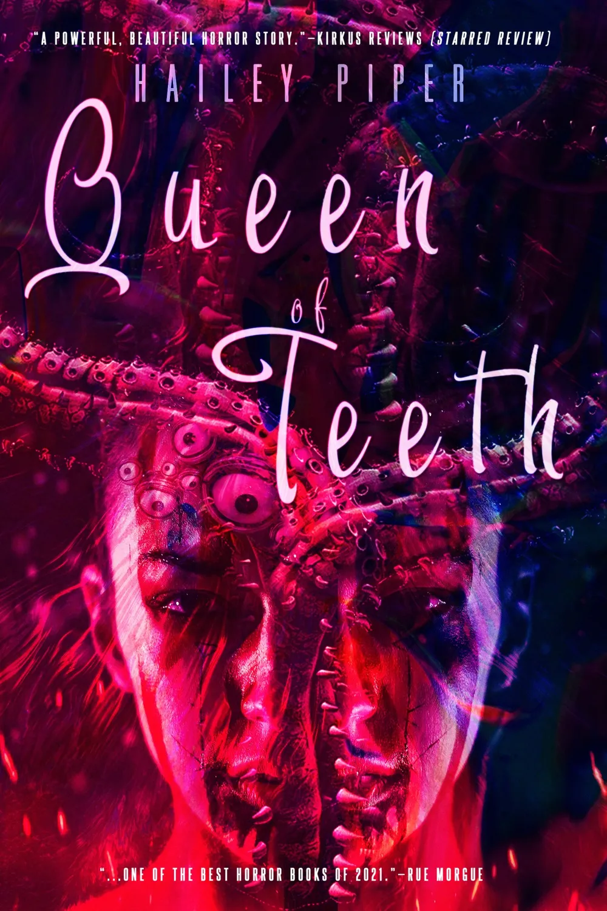
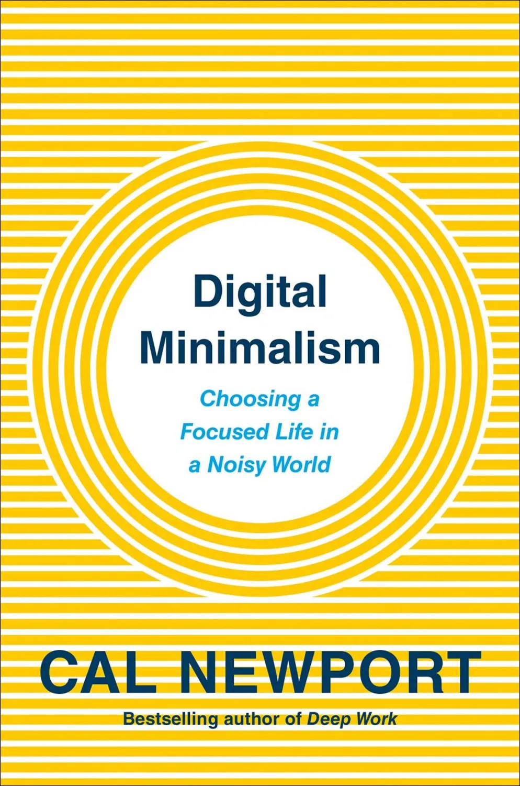





### Fiction


<--->

<--->



### Nonfiction



<--->

<--->

<--->



### Films
These likely won't get imagery as I'm way too picky. :-)

- You Won't Be Alone
- It Follows
- Gonjiam: Haunted Asylum
- The Dark and the Wicked
- The Wailing




## Superlatives

### Weirdest
- Possession: weirdest squid pro quo in cinematic history

### Best soundtrack
- It Follows
- A Girl Walks Home Alone at Night

### Most surprising
- Bones and All: surprisingly easy to stomach
- Titane: hear me out, Rosemary's baby, but a car

### Most comforting
- The Big Lebowski: yes, that’s like, my opinion, man.
- Addams Family: if your relationship goals aren’t Morticia and Gomez, then please rethink your life
- Shaun of the Dead: needs no further explanation 

### Watch on a loop forever with no audio
- The Tragedy of Macbeth
- Blade Runner 2049
- Eternal Sunshine of the Spotless Mind
- Mad Max Fury Road (black and chrome)

### Best “If I feel like hearing the same nirvana song over and over in a movie”
- The Batman 

### Most relatable superhero origin story
- John Wick

### Most “Good for her”
- Midsommar
- Carrie
- The Witch

### Best vibes
- Atomic Blonde
- The Hunger
- Sleepy Hollow

### Most “Why did this get made?”
- Mandy: Someone live tweeted an acid trip





### Incoming

- <mark>Feeding Your Demons (Tsultrim Allione)</mark>
- <mark>Ripe: Tales of Hunger & Desire (Various)</mark>
- Gone to the Wolves (John Wray)
- Witches, Witch-hunting, and Women (Silvia Federici)

### 2024
- Design as an Attitude (Alice Rawsthorn)
- Lilith's Brood (Octavia E. Butler)
- A Light Most Hateful (Hailey Piper)

### 2023
- Last Days (Adam Nevill)
- The Black Spider (Jeremias Gotthelf)
- Silver Nitrate (Silvia Moreno-Garcia) ❤️
- Halloween Season (Lucy Snyder)
- Sister, Maiden, Monster (Lucy Snyder) ❤️❤️
- Outrage Machine (Tobias Rose-Stockwell)
- Little Eve (Catriona Ward)
- The Last House on Needless Street (Catriona Ward) ❤️❤️
- Looking Glass Sound (Catriona Ward) ❤️❤️
- Dark Delicacies Vol. 1 (Various)
- Notes on Complexity (Neil Theise)
- The Handyman Method (Nick Cutter and Andrew F. Sullivan)
- Salem's Lot (Stephen King)
- The Destroyer of Worlds (A Return Lovecraft Country) (Matt Ruff)
- Little Heaven (Nick Cutter)
- The Deep (Nick Cutter)
- The Troop (Nick Cutter)
- ~~Unbury Carol (Josh Malerman)~~
- ~~Dead of Night: A Zombie Novel (Dead of Night Series Book 1) (Jonathan Maberry)~~
- Queen of Teeth (Hailey Piper)
- The Butcher (Jennifer Hillier)
- ~~Chaos Machine (Max Fisher)~~
- Mind Gut Connection (Emeran Mayer) ❤️
- Brain Energy (Christopher M. Palmer MD)
- Pretty Marys All in a Row (Gwendolyn Kiste)
- Boneset & Feathers (Gwendolyn Kiste)
- The Rust Maidens (Gwendolyn Kiste)
- Reluctant Immortals (Gwendolyn Kiste)
- Old Souls: The Sages and Mystics of Our World (Aletheia Luna )
- ~~Sundial (Catriona Ward)~~
- ~~The Paris Apartment (Lucy Foley)~~
- Come As You Are (Emily Nagoski Ph.D.)
- ~~Even The Worm Will Turn (Hailey Piper)~~
- No Gods for Drowning (Hailey Piper)
- The Worm and His Kings (Hailey Piper)
- Your Mind Is a Terrible Thing (Hailey Piper)
- Echo (Thomas Olde Heuvelt) ❤️
- Hex (Thomas Olde Heuvelt) ❤️
- Malorie: A Bird Box Novel (Josh Malerman)
- The Living Dead (George Romero) ❤️
- How Minds Change (David McRaney)




### Incoming
- Poor Things
- Significant Other
- Saltburn
- Careful How You Go
- Last Voyage of the Demeter

### 2024
- Fall of the House of Usher

### 2023
- The Rocky Horror Picture Show
- Anna and the Apocalypse
- Bottoms
- Escaping Twin Flames ❤️
- Talk to Me ❤️❤️
- TMNT: Mutant Mayhem ❤️❤️
- Asteroid City
- What We Do In the Shadows (s5) ❤️
- Foundation (s2) ❤️
- River ❤️
- The Descent 2
- The Blackening ❤️
- The Lost Boys
- Return to Seoul
- Squaring the Circle ❤️
- Oppenheimer
- Barbie ❤️
- Evil Dead Rise ❤️
- Scream VI
- The Angry Black Girl and Her Monster
- Come to Daddy
- John Wick: Chapter 4
- Scream VI
- Renfield
- Hellbender
- One Cut of the Dead
- The Devil to Pay
- Evil Dead II
- The Sadness
- M3GAN
- Bones and All ❤️
- Logan
- TÁR
- A Girl Walks Home Alone at Night
- Triangle of Sadness ❤️
- The Conjuring
- The Babadook
- Halloween
- World War Z
- The Neon Demon
- The Conjuring 2
- Zombieland: Double Tap
- The Purge
- Crimson Peak
- Scream 4
- Alien: Covenant
- Creep
- I Saw the Devil
- The Dead Don't Die
- Evil Dead
- The Nun
- Velvet Buzzsaw
- Warm Bodies
- The Autopsy of Jane Doe
- Annabelle
- Annabelle: Creation
- The Cloverfield Paradox
- Annabelle Comes Home
- Child's Play
- Unsane
- Apostle
- A Nightmare on Elm Street
- The Curse of La Llorona
- Let Me In
- Resident Evil: Retribution
- Slender Man
- The Invisible Man
- Smile
- Candyman
- The Conjuring: The Devil Made Me Do It
- Army of the Dead
- Halloween Kills
- The Menu

### 2022
- The French Dispatch
- Antlers
- Texas Chainsaw Massacre
- Nightmare Alley
- In the Earth
- The Batman
- Fresh
- Licorice Pizza
- The Power of the Dog
- Dune
- Don't Look Up
- The Dark Knight
- The Medium
- Raw
- Titane ❤️
- The Northman
- Everything Everywhere All at Once
- The Night House
- Green Room
- The Ritual
- The Dark and the Wicked
- Censor
- Malignant
- Happy Death Day
- Possum
- Caveat
- Saint Maud
- Mandy
- Get Out
- Last Night in Soho
- 10 Cloverfield Lane
- The Lighthouse
- Spree
- Relic
- Ready or Not
- X
- It Comes at Night
- 12 Hour Shift
- Come True
- The Invitation
- His House
- Possessor
- Don't Breathe
- Color Out of Space
- In Fabric
- Till Death
- The Handmaiden
- Prey
- Can You Ever Forgive Me?
- Incantation
- The Blob
- The Descent
- Hair Wolf
- Fight Club
- Pulp Fiction
- Gone Girl
- Knives Out
- The Wolf of Wall Street
- Inception
- The Grand Budapest Hotel
- The Shining
- Eternal Sunshine of the Spotless Mind
- Once Upon a Time… in Hollywood
- Inglourious Basterds
- Lady Bird
- The Godfather
- The Silence of the Lambs
- Blade Runner 2049
- Little Women
- The Social Network
- Little Miss Sunshine
- Black Panther
- Her
- Donnie Darko
- Drive
- Jojo Rabbit
- The Matrix
- Fantastic Mr. Fox
- Scott Pilgrim vs. the World
- 1917
- Thirst
- Blood Quantum
- You Won't Be Alone ❤️❤️❤️
- Glass Onion
- Home Alone
- Nope
- Pearl
- Barbarian
- Interstellar
- Joker
- National Lampoon's Christmas Vacation
- The Addams Family ❤️
- Mona Lisa and the Blood Moon ❤️
- Run
- The Woman King
- The Black Phone
- Moonage Daydream
- The Tinder Swindler
- Crimes of the Future
- Funny Pages
- Men
- Marcel the Shell with Shoes On ❤️
- After Yang ❤️
- Scream
- Bodies Bodies Bodies
- Hellraiser
- See How They Run
- Bad Santa
- A Christmas Story Christmas
- The People vs. Larry Flynt
- The Suicide Squad
- Promising Young Woman ❤️
- House of Gucci
- I Care a Lot
- The Tragedy of Macbeth ❤️
- The Woman in the Window
- The Social Dilemma
- The Hunt
- Decision to Leave
### 2021 and before
- The Wailing ❤️
- The Perfection
- Ravenous
- Gonjiam: Haunted Asylum ❤️
- A Tale of Two Sisters ❤️
- Moonrise Kingdom
- #Alive
- Train to Busan
- Peninsula
- Fear Street: 1994
- Black Widow
- No Sudden Move
- Zola
- Cruella
- In the Heights
- Parasite
- A Quiet Place Part II
- Bo Burnham: Inside
- Atomic Blonde
- Fear Street: 1978
- Slaxx
- John Wick
- John Wick: Chapter 2
- John Wick: Chapter 3 – Parabellum
- Gunpowder Milkshake
- A Classic Horror Story
- Fear Street: 1666
- Midsommar
- Orpheus
- Mayhem
- Vicious Fun
- Jurassic Park
- An Unquiet Grave
- The Beyond
- Ringu
- The Texas Chainsaw Massacre
- Rosemary's Baby
- A Quiet Place
- Us
- Black Swan
- It
- American Psycho
- Alien
- The Witch ❤️
- Annihilation ❤️
- Jaws
- mother!
- Shaun of the Dead
- The Thing
- What We Do in the Shadows
- It Chapter Two
- Zombieland
- Halloween
- It Follows ❤️
- The Cabin in the Woods
- Blood Red Sky
- Lucky
- Jungle Cruise
- Hereditary
- The Stylist
- Malevolent
- 28 Days Later
- Insidious
- Sinister
- Shutter
- Before the Fire
- Animal House
- The Host
- Jennifer's Body
- Resident Evil: Afterlife
- Rubber
- Resident Evil: The Final Chapter
- Abraham Lincoln: Vampire Hunter
- Pride and Prejudice and Zombies
- The Crazies
- Lords of Chaos
- Life After Beth
- Cargo
- Black Christmas
- The Lords of Salem
- The Silence





### See also
- [Design Bookshelf](/tools/guides/bookshelf)