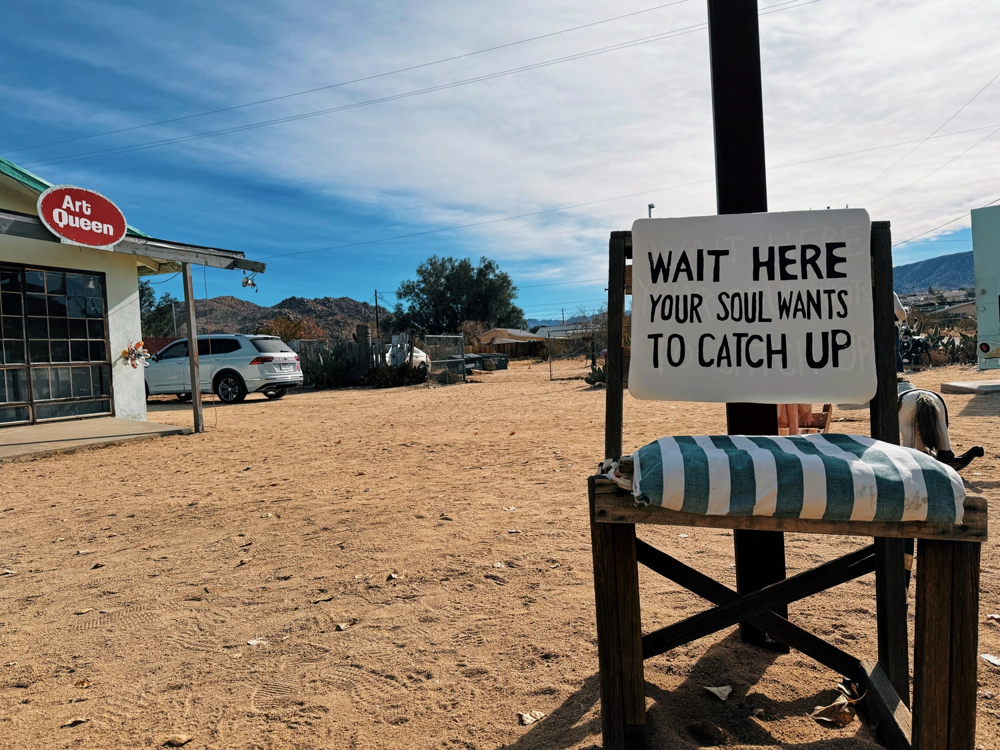

<article class="markdown book-post feature-block">
<figure>
  
</figure>
</article>



## Creations

[Visual Art](/art)
:	Mixed media collages, glitch art and skulls. Lots of darker themes exploring identity, loneliness, memento moris.

[Tinkering](/tinkering)
:	I like to take things apart and put them back together again. Sometimes I get lucky and something cooler comes out the other end.

[Photos](/photos)
:	Photosets from various adventures.
<--->
## Writing & Readings

[Journal](/journal)
:	A place where collect thoughts on topics that matter to me. (I'm intentionally not calling this a blog, as that comes with expectations of constant updates.)

[Read & Watch List](/media)
:	I watch and read a lot. Here’s some of it.

[Book Notes](/book-notes)
: A collection of highlights from books I’ve read.

