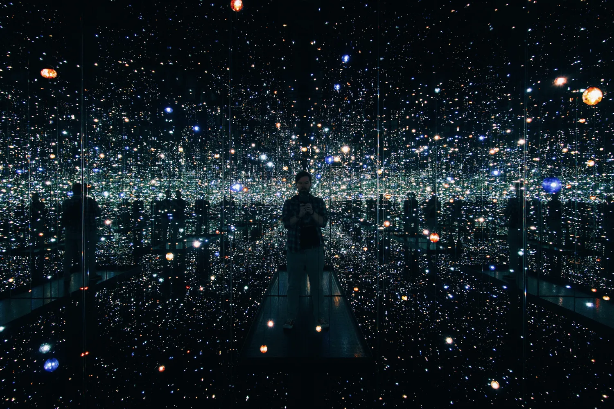

<article class="markdown book-post feature-block">
<figure>
  
  <figcaption>
  	Me at the Broad Museum.
  </figcaption>
</figure>
</article>



Creations
: ## [Visual Art](/art)
	Mixed media collages, glitch art and skulls (not real ones!). Lots of darker themes exploring identity, loneliness, memento moris. Also, tinkering.
: ## [Tinkering](/tinkering)
	I like to take things apart and put them back together again. Sometimes I get lucky and something cooler comes out the other end.
<--->
Writing & Readings
: ## [Journal](/journal)
	A place where collect thoughts on topics that matter to me. (I'm intentionally not calling this a blog, as that comes with expectations of constant updates.)
: ## [Read & Watch List](/media)
	I watch and read a lot. Here’s some of it.

