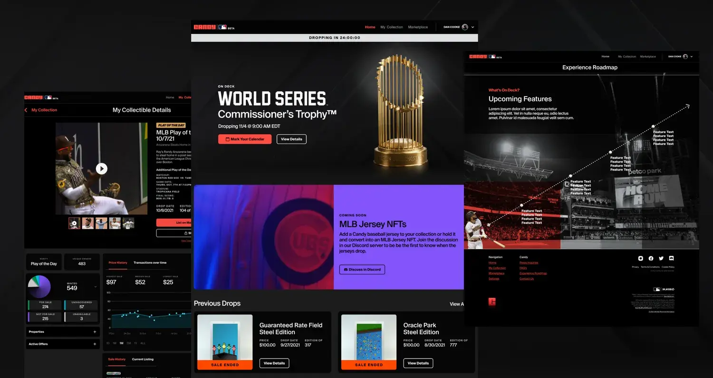
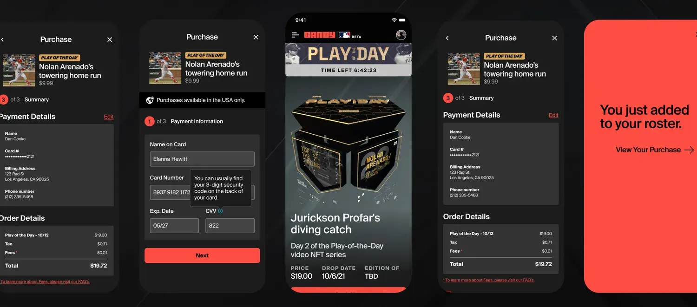
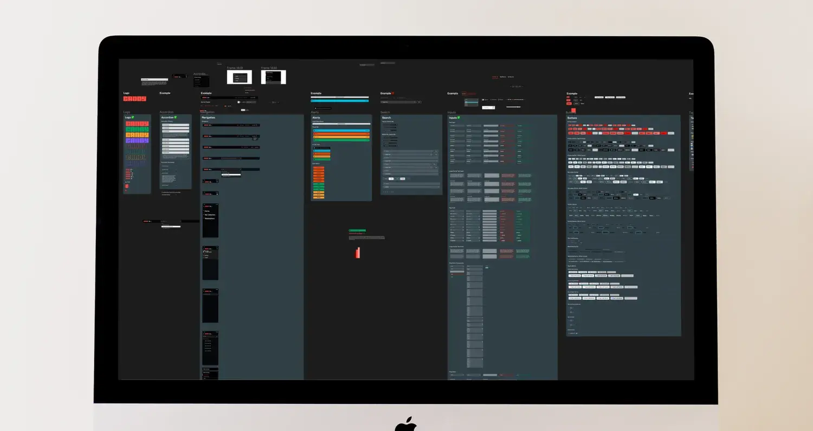
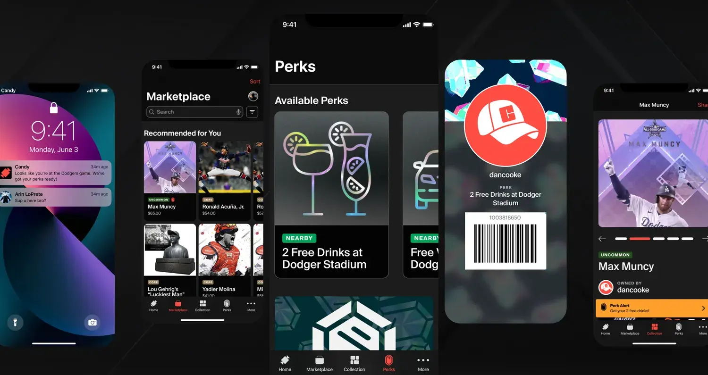

Candy’s approach to the NFT ecosystem changes how fans engage with their favorite sports. They allow collectors to purchase officially-licensed digital collectibles, understand their value, and trade them on a secure secondary market. Initially partnered with Major League Baseball, Candy has since announced upcoming collaborations with Premier League and NASCAR.

## Role
Through Artium, I worked as Candy’s founding designer and saw them through from concept to launch, including multiple iterations afterward. My work focused on crafting the design system the team uses, building the marketplace experience, and performing research to help decide what to launch. I also helped them develop their roadmap.

I built the design to scale to accommodate all the potential franchises Candy could bring on, and that themed them appropriately. To do that, I collaborated with a product manager to coordinate the work, a head of design to build their team, and five other designers. Given how quickly we needed to move, I tag teamed with the product manager to expedite the research process. I crafted a user interview plan and script, then interviewed sports fans, card collectors and crypto lovers. I sought to understand what’s important to them, how they collect memorabilia or other cryptocurrencies so that we could make something great.

## Challenge

Candy came to the table with a pitch deck, a partnership with the MLB and a deadline of five (!) months to launch their NFT marketplace. The initial launch required building and designing a platform from scratch that could handle complex financial transactions at scale.

## Approach

There were a few big issues that we needed to overcome: tech hurdles for adoption, the fluctuating nature of an NFT’s value, and how to build a design system that accommodates major, worldwide brands and the various experiences their fans expect. Each of our tasks began with user interviews, which drove all of the decisions we made. We spoke with crypto fans, sports lovers, and memorabilia collectors to inform our choices.

### Ensure Easy Adoption

I found that technologically inexperienced users would face difficulties interacting with Candy’s marketplace at any reasonable scale. Hands down the biggest offender was the problem of connecting digital wallets (e.g. MetaMask) and the process of purchasing NFTs. Existing NFT marketplaces offered little inspiration. OpenSea, a popular NFT marketplace, was a Lovecraftian nightmare. NBA’s TopShot had an average transaction time of two minutes, and even then you weren’t guaranteed to get the NFT you wanted.

To that end, I focused our efforts on making the purchasing process as smooth as buying anything else online. This meant downplaying the blockchain aspect, and deprioritizing transferral of NFTs to other wallets for the initial launch.

Part of the joy in collecting is showing people your collection. Collectors dedicate entire rooms of their houses to display their collectibles, so we tried for something similar on Candy’s digital platform. I tested customizable homepages and shareable collections, which were both well received by collectors. This also served as an entry point to the transactional nature of Candy, letting other collectors make offers. It was important to keep this as scalable as possible and minimize back-and-forth messaging, so we allowed someone to only make a numerical offer.

The team wanted to explore offering trades, but we couldn’t quite find a great way to accommodate that in the project’s limited timeline, so we postponed it for a later version.

### Demonstrate an NFT’s Value

The CEO of Candy, an ex-Goldman Sachs executive, wanted to pitch NFTs as an investment and enable collectors to chart the worth of their own collections. We tested and employed several methods of tracking collectors’ ROI:

- Notifications updating a collector that an NFT like the ones in their collection just sold for an amount 10% over the average price.
- Data visualizations that help collectors track the value of their NFTs over time.
- Featuring the highest-selling NFTs on the marketplace homepage.

### Create a Scalable Design System and Workflow

The foundation of any scalable design relies on a solid design system to help it grow. And with worldwide brands like Major League Baseball and NASCAR, we needed a system that could handle a little reskinning.

I built a design system that would enable any new designer to come in and hit the ground running. While I planted the seeds for this system and saw to its growth, we ultimately got a champion for this design system to help it reach full maturity and continue growing.

Here’s where we arrived:

- A fully fledged design system that lives in Figma and Storybook.
- Design workflows and file organization techniques that help a growing team stay focused.
- A site that can be reskinned to accommodate the nuances of each major brand that signs up for the platform.

### Consider the Future

It wasn’t enough to simply deliver the MVP and a version or two beyond it. We had to imagine the future of NFTs, and our research showed that NFT’s true value is in the following areas:

- Giving collectors access to exclusive, real-life perks such as discounts at participating merchants or signed memorabilia (and a nice tie-in with Fanatics, Candy’s parent company).
- Allowing these NFTs to act as a collector’s event ticket. This was massively important for NASCAR fans, who view their race tickets as a collector’s item.
- Allowing NFTs to unlock other digital collectibles or consumables in participating video games.

## Results

From the time of Candy’s launch to the end of the MLB season, fans purchased over $1,000,000 in NFTs. Their successful launch and fully enabled core technology team bolstered investors’ confidence in the Candy team and the premise of their company, resulting in an investment of $100 million at a valuation of $1.5 billion.

They liked us so much they wanted to hire some of our designers outright. 😄

Here's one of the many, many prototypes we tested. Geared towards the all around flow of signing in, purchasing, and listing an item for sale.

<iframe style="border: 1px solid rgba(0, 0, 0, 0.1);" width="800" height="450" src="https://www.figma.com/embed?embed_host=share&url=https%3A%2F%2Fwww.figma.com%2Fproto%2FowYGHh0alLQqHb6HHwD3M2%2FCandy-Experience-(Copy)%3Fpage-id%3D5149%253A119764%26type%3Ddesign%26node-id%3D5149-123185%26viewport%3D951%252C-195%252C0.03%26t%3DF4O5P6SVmY8XhM3c-1%26scaling%3Dscale-down%26starting-point-node-id%3D5149%253A123185%26show-proto-sidebar%3D1%26mode%3Ddesign" allowfullscreen></iframe>