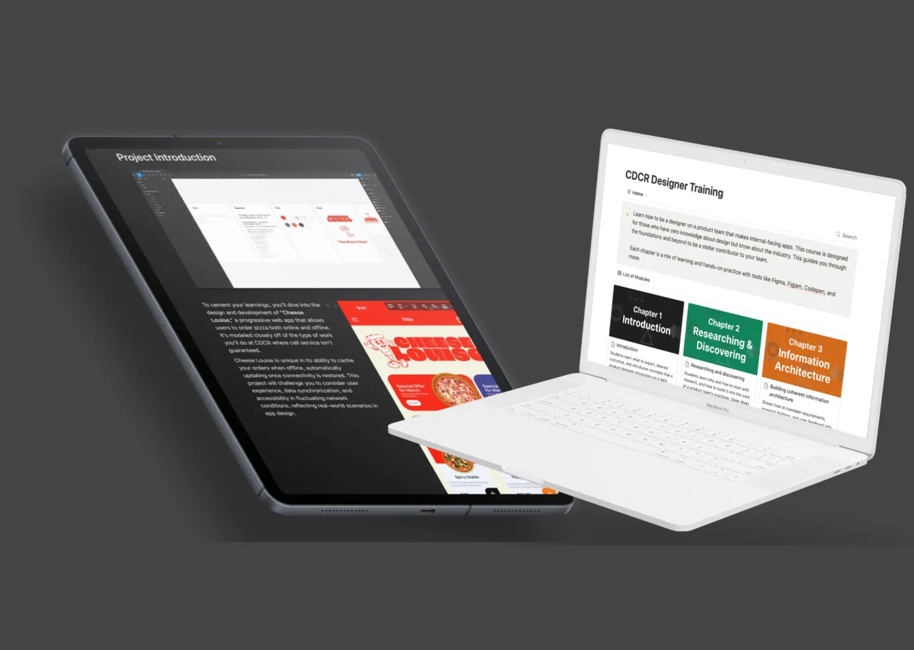

## Overview 
The California Department of Corrections and Rehabilitation (CDCR) required a comprehensive design system to streamline engineering workflows while improving transparency and fairness within their parole system. At the core of my approach was embedding human-centered design into CDCR’s processes, ensuring that every decision was rooted in understanding user needs, minimizing harm, and making informed, empathetic choices.

## Approach
My work emphasized the importance of user research, frequent testing, and rapid iterations to avoid unintended consequences and mistakes. I delivered a design system that supported both Vuetify and PrimeVue frameworks, enabling engineers to easily implement designs while maintaining a consistent visual language across platforms. This bridged the gap between design and code, allowing teams to focus on delivering solutions without worrying about technical inconsistencies.



<--->



Collaboration between engineers and designers was key to the success of this project. By fostering mutual understanding and clear communication, I was able to launch products in weeks that would have previously taken years. This was not achieved by Lost Horse's efforts alone—CDCR has been cultivating a highly capable team, and together developed a workflow that maximized efficiency and minimized friction between departments.

## Human-centered design training
In addition to building the design system, I provided in-depth training that covered human-centered design methodologies, user interviews, prototyping, and testing strategies. This empowered the CDCR team to conduct user research, rapidly validate ideas, and iterate on designs to ensure they met real user needs.

## Results

- **Increased Engineering Efficiency:** The design system standardized components and ensured visual consistency across platforms, reducing complexity and overhead for engineering teams.
- **Human-Centered Design Integration:** The design system and training embedded a user-focused approach into CDCR’s development process, enabling designers to conduct frequent interviews and testing to ensure solutions directly addressed user needs.
- **Improved Parole Reporting Transparency:** Enhanced communication tools provided clearer expectations and progress tracking for parole officers and parolees, resulting in more accurate evaluations. 
- **Bias Reduction in Reporting:** By restructuring reporting language and format, I reduced the chances of bias influencing the process, promoting fairness.
- **Enhanced Safety and Accountability:** System improvements allowed for better tracking of parolees, particularly in high-risk situations, improving safety for both agents and parolees.
- **Faster Product Launches:** Due to improved communication between engineers and designers, products were launched in weeks rather than years. 
- **Smoother Parole Completion Process:** A new scoring system provided parolees with clear guidelines and efficient paths to complete their requirements, ensuring transparency and minimizing unexpected interventions.