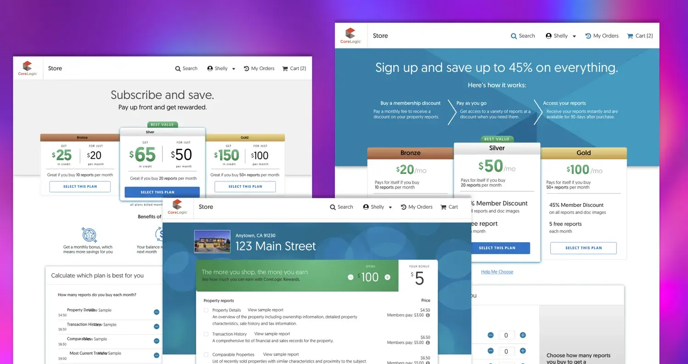
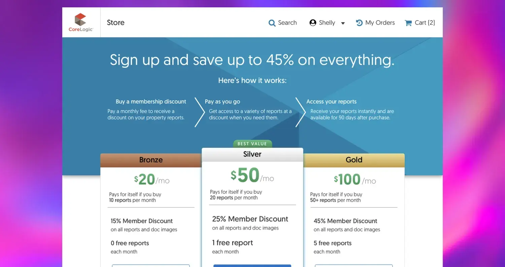
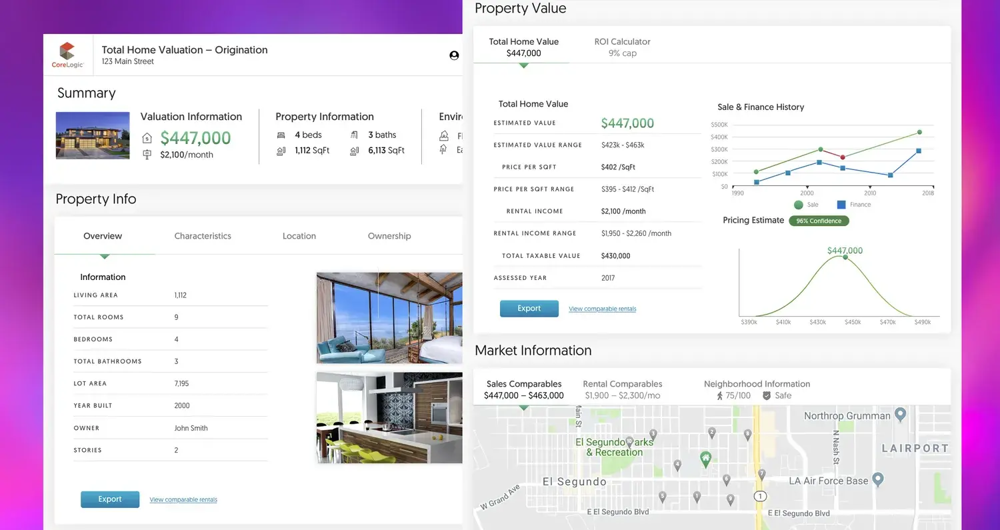

If you’ve ever purchased a home, you know how complex the process can be. There are multiple parties involved—the buyer, the seller, realtors, mortgage lenders, and others. Each have their own priorities. CoreLogic, whose insights are used in 75% of all mortgage and capital market loans, needed to make the process of doing this easier. They had 10,000 customers and a need to easily sort through 3.5 billion property and financial records (all of which were spread across multiple parties and in different formats).

## Role
I came into this project as a product designer for Pivotal Labs after it kicked off, so I can’t speak to how the decision to build a new, updated store with customized reports came along—I can, however, speak to how I diligently worked and the customer research I did to make this a reality.

During my time at Pivotal Labs, I worked on enabling CoreLogic's team to utilize modern software methodologies. I focused on both enablement as well as delivery. One notable part of this project was that each role practiced bits of Extreme Programming so that we could go faster together, meaning I had a design pair from CoreLogic, so did the PM, and so on.

## Process

To make this store a reality, and with a timeline of 6 months, we needed to do the following: understand the customer base, test our assumptions with them, and move with speed and intention towards the future. On top of that, we needed to help them visualize what the future could look like with subscription revenue.

To do this, I created user interview plans, tests, and scripts so that we could be consistent in gathering information. This let both myself and the product managers split off and combine our efforts to move faster. I also invited engineers to be part of this, as it boosted team cohesion and built a shared understanding. We then came together to see what patterns emerged and what insights would guide future iterations.

When it came to subscriptions, we tested prepaid credits as well as standard monthly pricing. Ultimately the standard monthly pricing worked best and addressed most customers' needs. One user said that it was less to manage and were happy to not think about a credit system.

When I came in, we weren’t designing for mobile or accessibility, so I made the case to the product management and stakeholders on why we should. It required a couple backlog and roadmap changes, but I successfully made the case. It paid off, too. More on that in a moment.

Along the way, we implemented other improvements as a result of our research, typeahead searching and a membership calculator to support people in converting to paid members.

And to aid in growth, we adopted atomic design for this and built an early-stage design system so that CoreLogic’s team could focus on higher value tasks, not the shape of a button.

## Results

In the end, we launched and made a few iterations afterward. We achieved several major goals:

- More than double transactions, with 50% of them coming from mobile (up from 15% before)
- A higher SEO ranking as a result of designing for accessibility
- A roadmap that included subscriptions
- An enabled team who took over the design process after we left