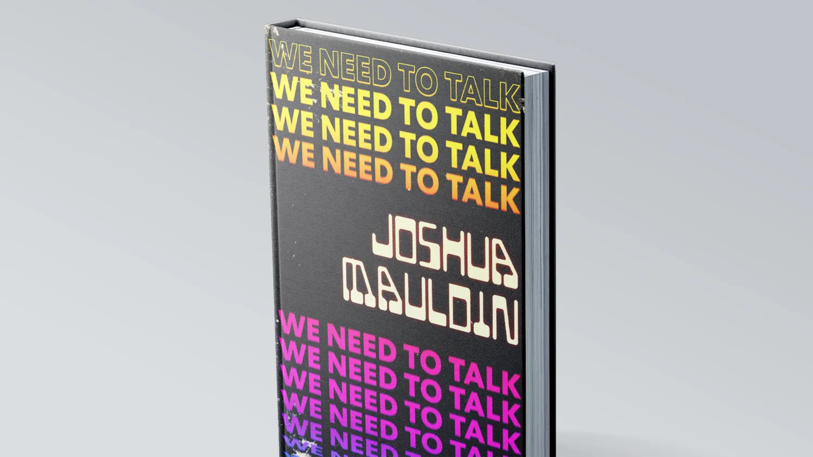

<article class="markdown book-post feature-block">
	<a href="/we-need-to-talk">
		
		

		<h2 class="post-title">
		We Need to Talk
		</h2>
	</a>
    	
I'm writing a book on how to have hard conversations at work. It's basically conflict resolution for people who hate conflict. It’s due later this year and will be published by Rosenfeld Media.

    

</article>



Artifacts
: ## [Portfolio](/portfolio)
	I'm a human-centered designer with over 15 years under my belt. As a player-coach, I've led teams for 5+ years. This is a collection of award-winning iOS, Android, and web designs.
: ## [Guides & Articles](/tools/)
	A collection of things I've written, plus guides for leaders, workshop facilitators, and other curious people.
: ## [Design Philosophy](/design-philosophy/)
	The why behind how I do it.
: ## [Appearances](/appearances/)
	Why
: ## [Design Process](/design-process)
	How I do what I do.
<--->
Services
: ## [Workshops & Speaking](/working/)
	Places I've spoken at and workshops I offer.
: ## [Coaching & Consulting](/coaching)
	Services I offer to clients and aspiring leaders.


