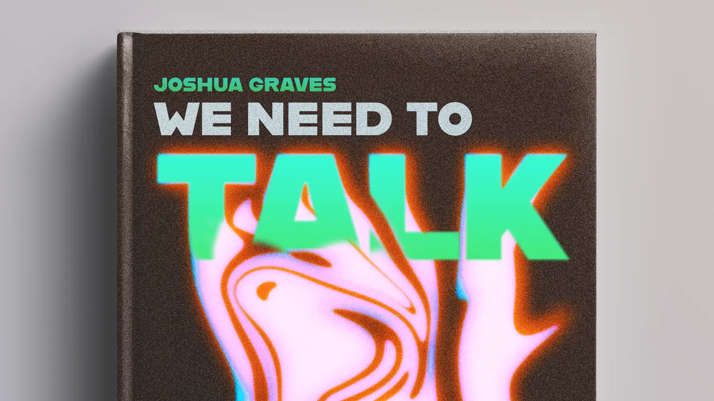

<article class="markdown book-post feature-block">
	<a href="/we-need-to-talk">
		
		

		<h2 class="post-title">
		We Need to Talk
		</h2>
	</a>
    	
I'm writing a book on how to have hard conversations at work. It's basically conflict resolution for people who hate conflict. It’s due later this year and will be published by Rosenfeld Media.

    

</article>



## Artifacts

[Guides & Articles](/tools/)
:	A collection of things I've written, plus guides for leaders, workshop facilitators, and other curious people.

[Design Philosophy](/philosophy/)
:	The why behind how I do it.

[Design Process](/process/)
:	How I do what I do.

[Portfolio](/portfolio)
:	I'm a human-centered designer with over 15 years under my belt. As a player-coach, I've led teams for 5+ years. This is a collection of award-winning iOS, Android, and web designs.

<--->
## Services
[Lost Horse Labs](/lost-horse)
:	I founded a digital design agency focused on human-centered design and sustainability.

[Work With Me](/work-with-me)
:	Let's talk about how I can help your team.

[Workshops & Speaking](/workshops/)
:	Places I've spoken at and workshops I offer.


