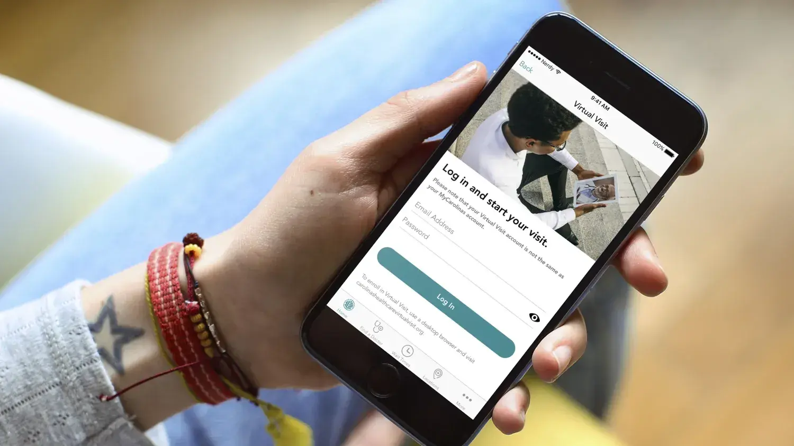
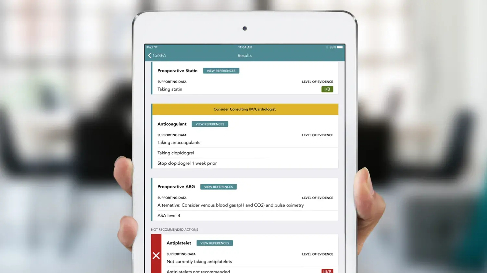
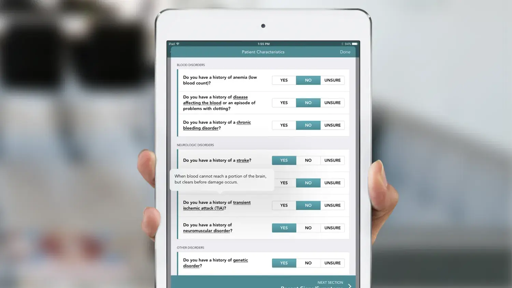

## Role
In 2017, I was the designer on two projects with Carolinas Healthcare System (now Atrium Health) during my time at Cardinal Solutions. Together, we released multiple iterations of two separate apps, the main patient-facing healthcare app (seen below) and another algorithm-focused app called CeSPA. While the work was done through an agency, we acted more as a longer-term product organization where we saw to multiple releases and iterations.

## Patient-facing App

For their patient-facing app, I developed a flexible, card-based design language and proposed a streamlined information architecture based on a mix of current patient needs, which were gathered from user interviews and stakeholder conversations, as well as items ahead on the client's roadmap.

I also lead the design and implementation of Virtual Visits, which turned out to be prudent (it was pre-covid), allows patents to get care anywhere they are. Most of our testing and research focused on how to reduce ER wait times and congestion. We also built tools that helped patients book visits without the need to contact a human. This dramatically reduced time spent on hold and the resulting frustration.

## CeSPA

I also worked on CeSPA, their first use of machine learning and AI. This was designed to save both patients and hospitals from unnecessary pre-operative procedures by creating and using an always up-to-date algorithm utilizing the latest research.

In my research conducted in concert with the CeSPA team, I found some providers weren't always up to date on the latest research and standards, leading them to recommend unnecessary procedures; our app alleviated that issue.

Given that the domain was healthcare, this required me to up my game on all things accessibility, both in terms of design and flow, but also helping our engineers understand how to code things properly for VoiceOver and other assistive technologies. Throughout this process, we did user testing with providers and patients alike, ensuring we had the best possible experience for them regardless of their ability or language.

Through careful collaboration and research with our providers, we were able to reduce paperwork, clinic wait times, and ultimately fewer unnecessary surgeries.

## Results

- Winner: [2018 eHealthcare Awards for Best Native Mobile App](https://ehealthcareawards.com/2018-winners/best-native-mobile-app/)
- Saved hundreds of thousands of dollars on unnecessary pre-operative procedures
- Developed a new design foundation for the next generation of the app