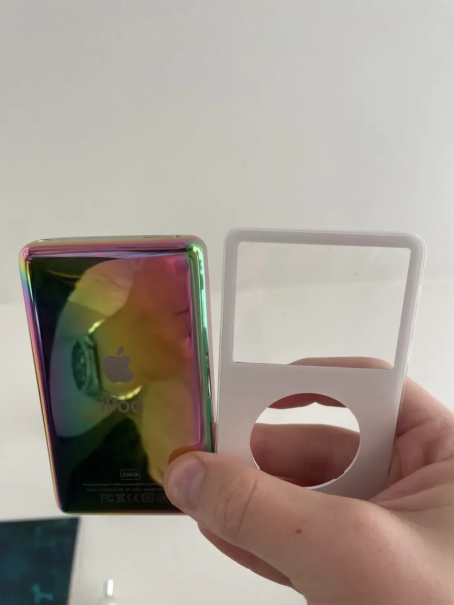
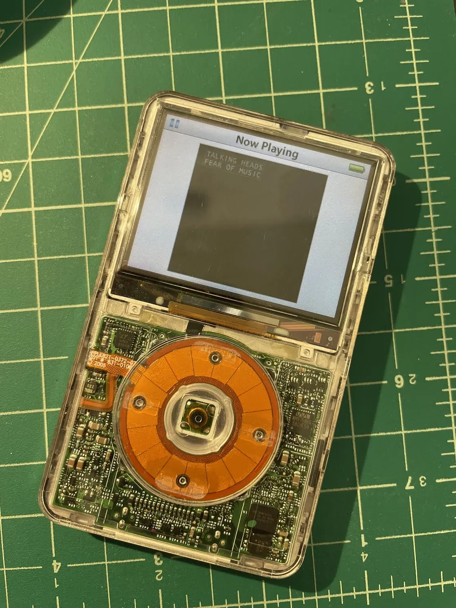
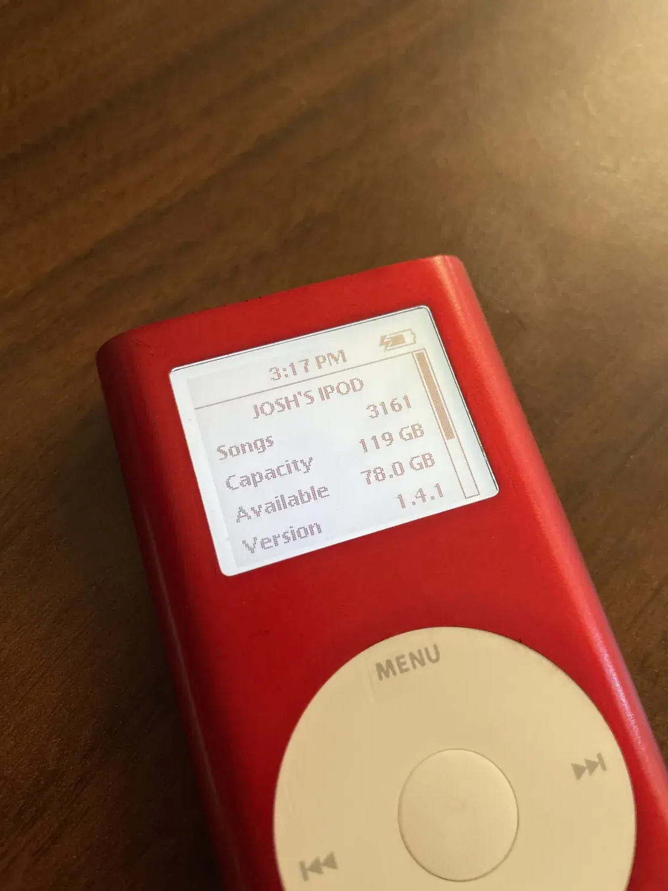
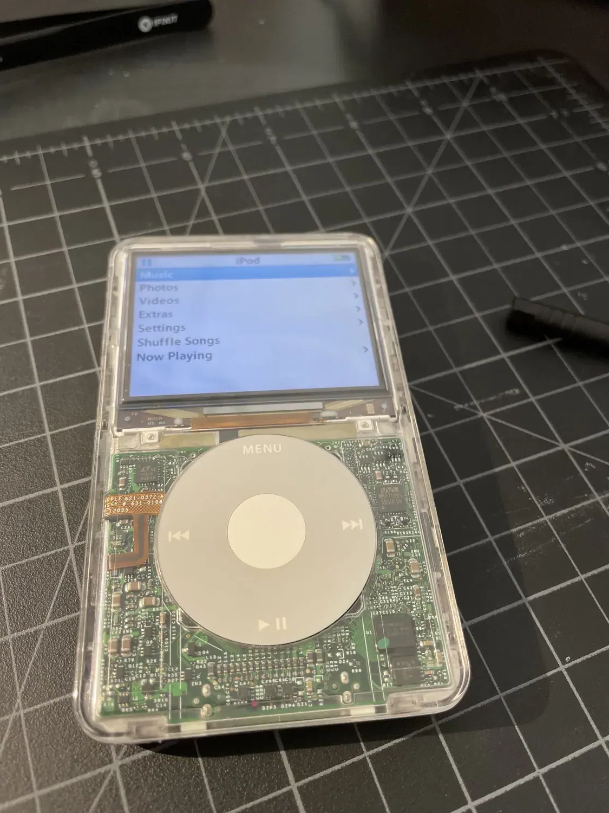
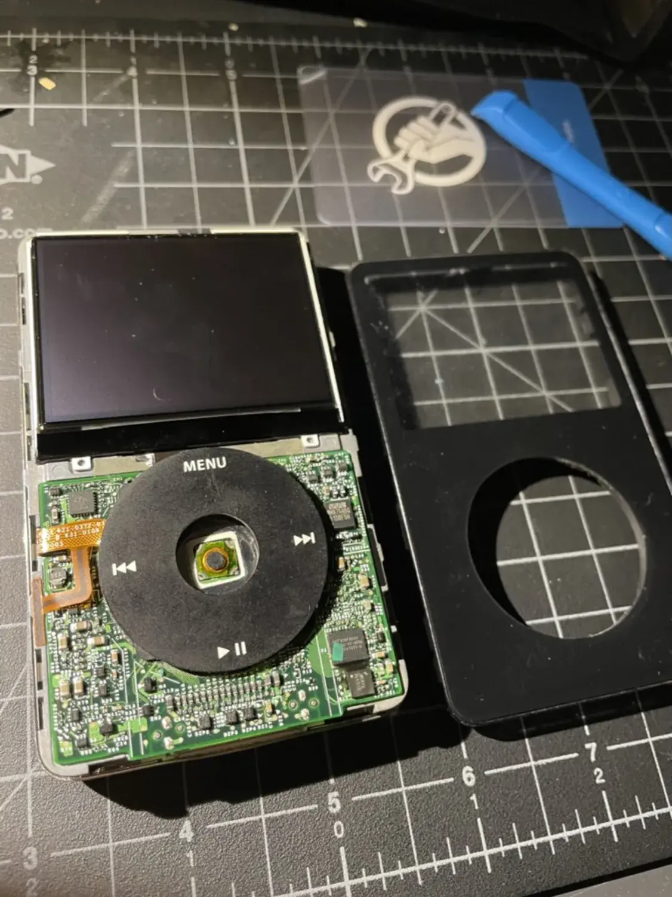

I restore older iPods because I love their focus and simplicity. It had everything I needed, plus Solitaire. It also *didn't* have things like push notifications or a billion apps. They just...play music.

This isn't a hard or expensive hobby to get into, either. Old iPods are dirt cheap on auction sites. Some I bought for $10. Once I bought 15 for $50.

## Where to start
If you're looking to start, old iPod minis are the easiest. They're relatively easy to open, cheap, and you can get a compact flash card and swap out the hard drive, easy peasy. It'll give you a comparatively infinite storage space and much better battery life than the original. (You can also replace the batteries).

Most of these mods do not require soldering, which is great for entry level folks. (If you wanted to add Bluetooth to an iPod, that's another story.)

The second easiest to modify are the 3rd, 4th, and 5th generation iPods (including the color screen ones). The construction is relatively the same, and allow for easier access to the internals. It's relatively well documented online, too.

## What to get
- [iOpener](https://www.ifixit.com/products/iopener) - $20
- Old iPod (go check eBay or a local auction site) - $20
- Compact Flash card OR [CF adapter](https://eoe.works/collections/apple-ipod-mini-2nd-generation-replacement-parts-4gb-6gb/products/cf-to-sd-card-compact-flash-adapter-sdhc-sdxc-udma-type-1-microsd) + [SD card adapter](https://eoe.works/products/copy-of-cf-to-micro-sd-card-compact-flash-adapter-sdhc-sdxc-udma-type-1-microsd?pr_prod_strat=use_description&pr_rec_id=b11b8f2b9&pr_rec_pid=5241500893321&pr_ref_pid=5234879660169&pr_seq=uniform) + [microSD card](https://eoe.works/products/32gb-64gb-128gb-256gb-512gb-microsd-card-sdhc-sdxc-adapter-mixed-brand-name?pr_prod_strat=copurchase&pr_rec_id=6b77a3090&pr_rec_pid=6742407872649&pr_ref_pid=5241500893321&pr_seq=uniform) of your choice - $20-$50
- Windows computer to restore iPods (newer Macs seem to have the most difficulty with this, but you can do it)
- Some paint (hand painting gives a more tactile feel, but a good spray paint works wonders. )

For guides, check:
- [iFixit](https://www.ifixit.com/Parts/iPod)

## Other thoughts
iPod 6th generation and beyond come with much more difficult frames to open. The "fat" nanos also have a similar design, and bending the metal pieces that hold the frame together is pretty unforgiving.

Anything with flash memory (iPod nano, Shuffle, and Touch) can't support memory upgrades as things are soldered to the little board. They're also extremely difficult to open.



<--->





<--->



