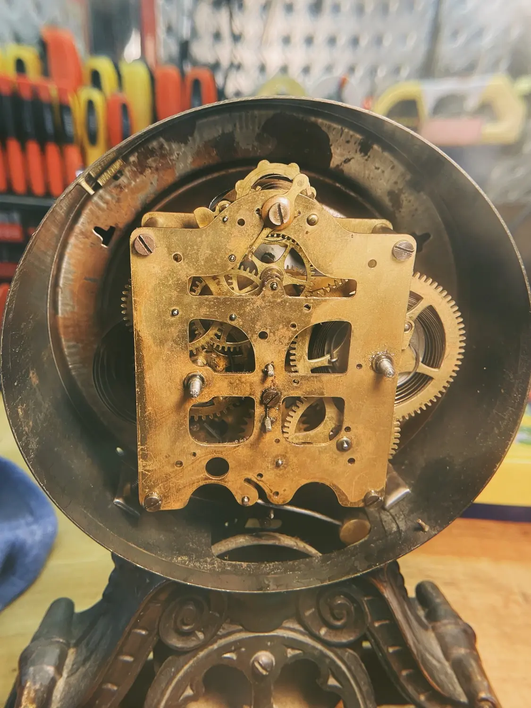
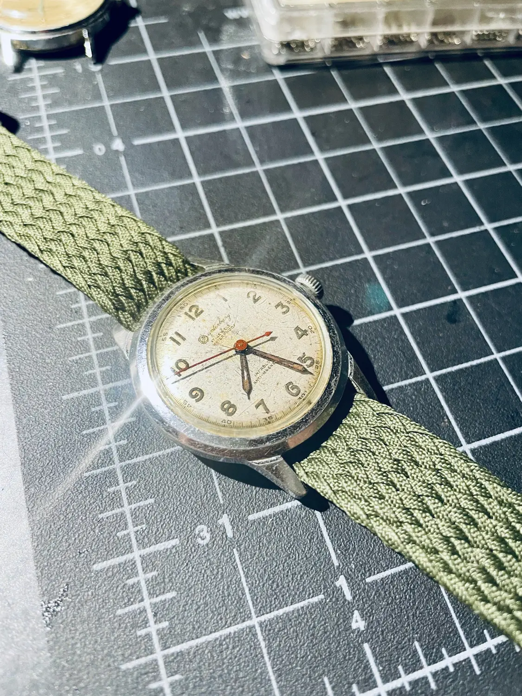

I love looking at these and trying to understand how they work. I'm not always successful in fixing them, but I have done it with a few!

My grandfather was a horologist, and using his tools helped me feel a little closer to him. And I got to learn a lot. 



<--->

