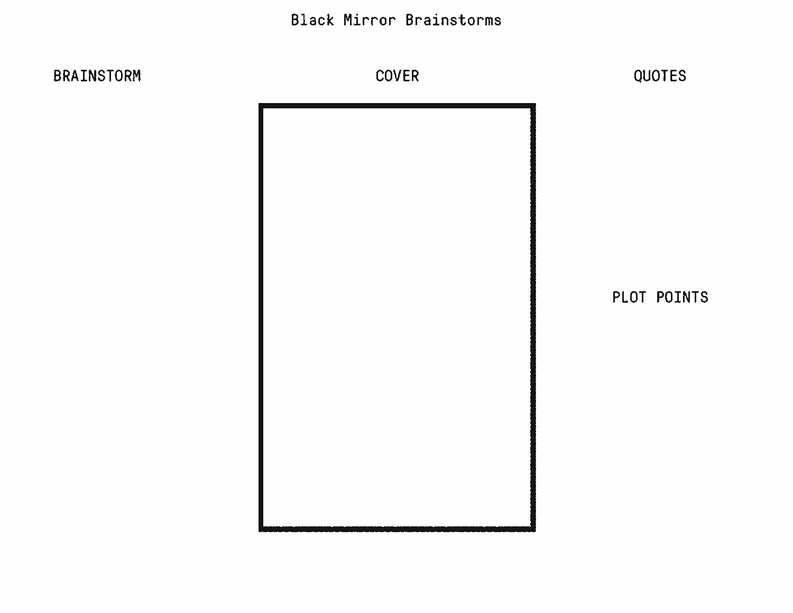

I want to have more ethical products. I feel like we all do. Sometimes, though, we don’t consider how this amazing thing we’re working on might have some unintended and negative consequences.

In my job, I help clients build products. Part of the process is framing the project and defining our goals. We also talk about anti-goals, which are things we absolutely don’t want to happen and run counter to our intentions.

If you’ve ever seen Black Mirror, the show excels at diving into how our products can have (severe) negative impacts on our society. I thought it might be an interesting idea to make a product design exercise out of it. Enter Black Mirror Brainstorms.

This exercise helps us guard against the negative effects of our goals by giving us a clear understanding of how our product could be misused. The outcome of this exercise is to more clearly define our anti-goals. Here’s how it works.

## About the Exercise

- Groups of 3–4 people
- Play time: 30–45 minutes (depending on the number of groups)
- 2 minutes to explain/give example
- 15 minutes to sketch
- 2–5 minutes to present
- 5 minutes to define anti-goals
- Before the activity, create a template to distribute to each team
- Provide markers, paper, stickies
- Each team should get one template to work on together

## How to Play

The exercise breaks down into four sections: the **brainstorm**, **quotes,** **plot points**, and the **poster**. Here’s a template.

Next we’ll start with an example to get us thinking.

> Let’s say we’re a large technology company who’s looking to have the most personalized content so people will spend more time in our product. To do that, we’re building a targeting engine that sifts through millions of data points to spot trends. Our goal is to figure out how this can go wrong for people who we’re collecting data on.

Now let’s get to each of the sections.

### Brainstorm

Here, we’ll write down some of your ideas for what might go wrong. Here are a few areas to help frame your activity:

- **Economic Issues:** could we enable bad faith actors to prey on vulnerable groups?
- **Politics:** could a corrupt government could use this info to identify and target dissidents?
- **Social Issues:** could our product reinforce already-present societal divides?

> Important note: some folks won’t do well thinking on the fly in a group setting. To help them, instruct everyone to take 2–5 minutes to think up ideas before talking with the group. The stickies you provide are perfect for this.
> 

### Quotes

This section is for quotes people in the episode might say. It can also be things people say about the episode after watching it.

Don’t be afraid to get dramatic or go over the top.

### Plot Points

Plot points are helpful in describing how this bad situation comes to pass. They’re the substance of the story. Consider these four as a starting point:

- The characters: who’s going to be affected
- The setup: the well-intended idea
- The problem: how the well-intended idea goes wrong
- The effect: how the idea going wrong affects people

### The Poster

Here, we’ll communicate the big idea. I suggest using a big quote that sums up the episode. If a team’s so inclined, they could also do an illustration.

## After the Exercise

When everyone’s finished presenting, take a moment to look for common elements from everyone’s posters and write them on stickies. We’ll take the stickies, put them up, and group similar ones together. These are excellent candidates for anti-goals.

## Wrapping up

We don’t have to look far to see how this might be helpful. Consider that [Target figured out a teen was pregnant](https://www.forbes.com/sites/kashmirhill/2012/02/16/how-target-figured-out-a-teen-girl-was-pregnant-before-her-father-did/#7f6150856668) and started sending her pregnancy-related coupons, much to the shock and anger of her parents. Another time, Facebook year in review showed [Eric Meyer a photo of his recently-deceased daughter](http://meyerweb.com/eric/thoughts/2014/12/24/inadvertent-algorithmic-cruelty/) surrounded by confetti and dancing people. None of these things products intended to be cruel. But because the designers didn’t consider the negative implications of their decisions, unintended things happened (and some of them were pretty rough).

Black Mirror Brainstorms are intended to help us consider the negative impacts of our work. By doing this, we help ensure that our products are great and don’t end up causing harm. The unceasing march toward growth will often pull us in unexpected ways and it’s easy let any negative impact of our decisions fall by the wayside.

## Credit and thanks

Adapted from [Aaron Lewis](https://twitter.com/aaronzlewis/status/1063544871472914432) and Gamestorming’s [Cover Story](https://gamestorming.com/cover-story/) activity. Thanks to Andrew Zusman, Christine Luc and Weiman Kow at Pivotal for the feedback.

[Original post](https://uxdesign.cc/black-mirror-brainstorms-f919ccf5938c)