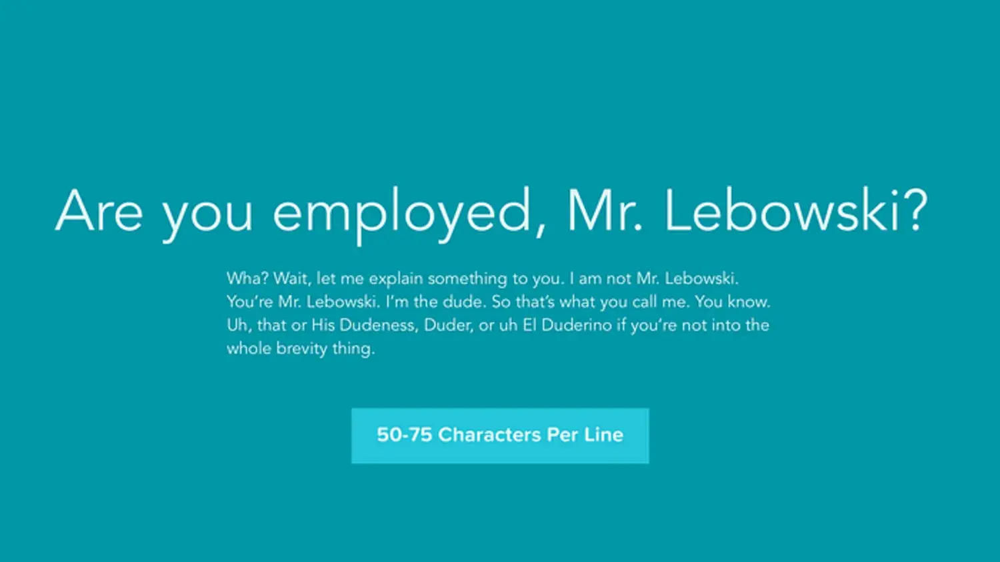
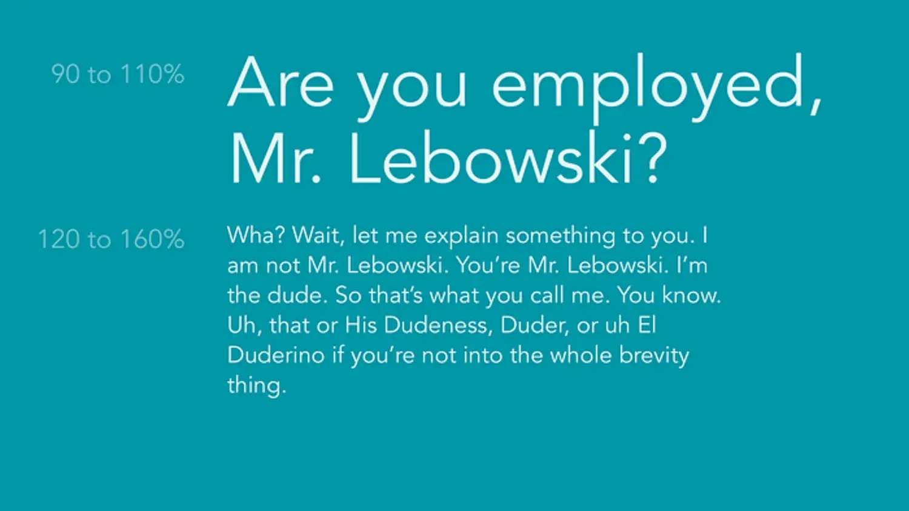
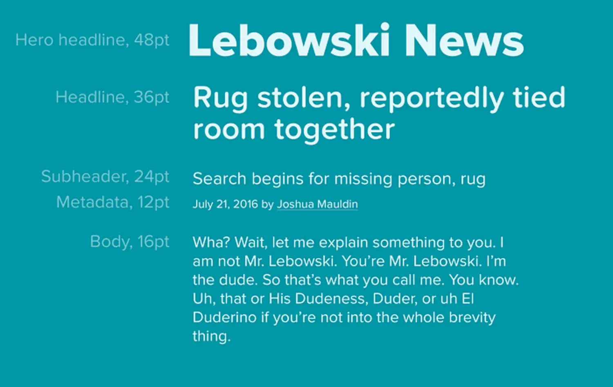
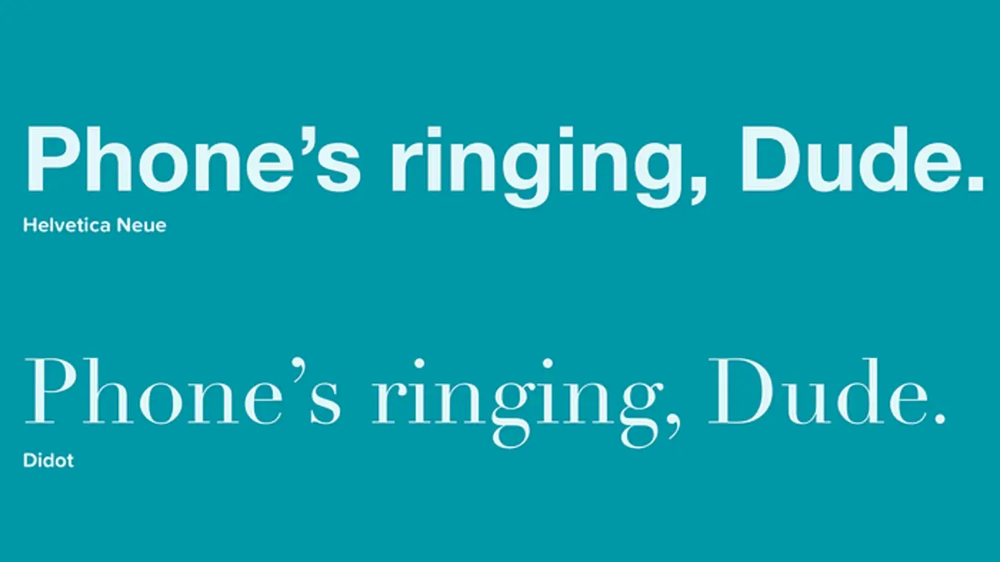

I’ve had lots of conversations about typography over the last few years. Which is cool, because I love it so much (so much that I decided to make [my own typeface](http://uptownsans.com/)). It’s exciting to see so many designers caring about making a beautiful group of letters that people want to read.

One common theme I see in these conversations is how to get the best readability with text. We usually end up talking about serif vs sans serif, line height, line spacing, and other tricks. I’d like to share some of them with you here.

These ideas aren’t prescriptions or laws, nor should they be perceived as such—they’re only guidelines to help you think about what works best for your design.

## Line length

If you’ve ever gotten tired from reading a paragraph, it could be because the length isn’t right. The best thing to do is keep your line lengths between 50–75 characters. This helps your eye easily scan what’s in a paragraph without getting tired.

Anything longer than 75 characters increases the chances you’ll re-read a paragraph. Shorter widths will find you losing the train of thought as you jump from line to line.

So, when is it best to 50 characters rather than 75? I look at it like this: between 16 and 42pt text, you can go closer to 75 characters. For type sized outside those bounds, I stay closer to 50 characters.

Line length is an important factor to consider when it comes to responsive design. I’ve seen many sites which forget about how phones or larger screens will handle text. That leads to a poor reading experience — leaving the text to fill the available area without thought to how wide a line is hurts the reading experience.

## Line height

Another factor affecting readability is the spacing between lines. It’s known by a few names: line height, leading, or line spacing. When discussing line height, I separate it out in two parts: headlines and everything else.

I’ve found I have the most impactful headlines if I use 90–110% line height. This helps a short burst of text have the oomph it needs without feeling too airy. It also makes headlines feel more tightly connected if they wrap to another line. If you’re working with CSS, avoid using pixels for this and let it be relative to the type size. I set it like this: h1{line-height: 1.1;}

For regular text, you’ll want to consider a line height that’s 120–160% of the font size. This helps your lines have adequate breathing room. Too much and your paragraph begins to look like distinctly separate lines. Too little and your characters will touch each other from line to line.

Ideally, your text should read like a nice, big grey box when you squint at it (or apply a blur to it). If it looks more like individual lines or a darker block of text, you’ve probably got a line height problem.

These percentage ranges give you a baseline to work with for your typography. Each typeface is different, and what you choose won’t be the same every time.

## Text size and hierarchy

It’s good to have a system when you make text. A system helps you make better, more strategic decisions when you’re adding new elements to your design.

To get one started, think about the text that’ll be the most plentiful in your design — base everything else off of that. You’re probably going to have lots of paragraphs in your designs, so I usually start there. Next, think about other elements: headers, subheaders, etc. Once I have them, I usually like to plug my designs into something called [Modular Scale](http://modularscale.com/) to help build a hierarchy.

Modular Scale uses the concept of musical scales to help build a hierarchy. Just like scales help bring harmony to a piece of music, having a typographic system keeps everything in sync as you add new elements.

Most of my designs start out with 16pt as a base, because anything smaller tends to be tougher to read. If I’m designing for iOS, I start at 17pt because that’s what iOS sets as the default. It’s weird to me, but [shrug emoji].

## It’s not about serif vs sans serif

The debate over serif or sans serif being more readable has gone on for a long time. Like, decades. Alex Poole has a nice [meta-summary of serif vs sans serif arguments](http://alexpoole.info/blog/which-are-more-legible-serif-or-sans-serif-typefaces/) which articulates arguments from both sides (with research!). Given that, I choose to reframe the debate and think about something else: contrast.

If you’re unfamiliar with how contrast applies here: it refers to the balance between the thick and thin strokes in a character. (We’ll talk about color contrast in a moment).

Just like with photos, you’ll want to have enough contrast make out what you’re seeing easily. Too much in a photo and everything looks like a blown-out 90s album cover, too little and you can’t make out a thing.

Look at Helvetica on the top, and Didot below it. Notice the difference in the stroke around E. Helvetica has a much lower contrast since the stroke is largely the same. Didot has much more contrast. Both are usually good for headlines since those are short and don’t require significant effort to read.

Incidentally, this is where Helvetica falls down — its low contrast and (nearly) uniform stroke aren’t the best for long-form text. I still don’t swoon for it in headlines, but it’s definitely got some utility.

For me, something with decent contrast is nice. Avenir works great for reading, as do Tisa and Georgia. Many type families have versions specifically for headlines and specifically for reading, too. Go try them out!

## Color contrast

Last, but certainly not least is about the color you choose. It doesn’t matter how great your type choice, or if you’ve done everything else in this post: people have to be able to see the text you’re giving them to read.

Make sure your text’s contrast meets one of these two [WCAG’s](http://www.w3.org/TR/2008/REC-WCAG20-20081211/#visual-audio-contrast-contrast) contrast levels:

- Level AA, which is **4.5:1** for text below 18pt, **3:1** for 18pt and larger
- Level AAA, which is **7:1** for text below 18pt, **4.5:1** for 18pt and larger

There’s a neat [plugin for Sketch](https://github.com/getflourish/Sketch-Color-Contrast-Analyser) and other apps have similar plugins to help you get the right contrast. Level AA and AAA ensure folks with vision issues can still read your text without problems. Some may find this limiting, but I find this liberating—I know if I choose something with adequate contrast that anyone can read it without issue.

Sometimes a client will have you using colors which aren’t within those guidelines. When that happens, we should tell our clients so and recommend a close approximation that matches their brand standards. If you’re lucky, it’s not their primary brand color causing a problem.

## In closing

This is by no means an exhaustive discussion of how to get the best readability with text, but it should help you along the way. I’m considering writing more about typography and readability, so please leave me a comment on what you’d like me to look into.

Also: if you’re looking to learn more about typography, get Ellen Lupton’s excellent [Thinking with Type](https://www.amazon.com/Thinking-Type-2nd-revised-expanded/dp/1568989695/ref=sr_1_1?ie=UTF8&qid=1469045558&sr=8-1&keywords=thinking+with+type). Or Jason Santa Maria’s [On Web Typography](https://abookapart.com/products/on-web-typography). I have a bookshelf full of nerdy reading material on this subject, but those are two of my favorites.

Happy typing!

[Original post](https://medium.com/@joshuamauldin/typographic-strategies-for-great-readability-also-a-lot-of-quotes-from-the-big-lebowski-7b8e31dafbda)
