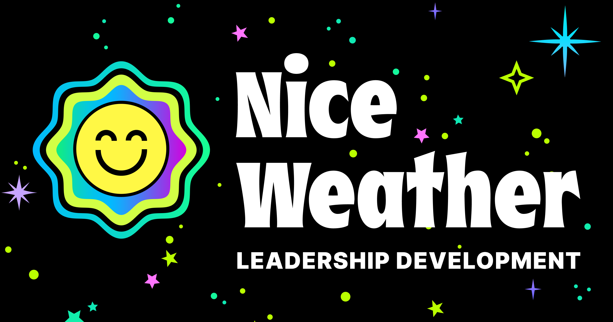

## Consulting

I help my clients build new capabilities, products, and teams. I also help them do it in a way that’s tailored specifically to them, their business, and culture—I don't just give them a process to follow and take their money.

I have over 15 years of experience and 5 of leading teams as a player-coach in healthcare, retail, and other industries. My multidisciplinary approach and experience with design, code, and management allows me to work closely with engineers, product managers, and stakeholders alike to know what they need for success.

You can learn more about [my process](/process) and the [philosophy](/philosophy) that underpins it, too.

### Services I Offer

- Design systems
- Design consulting
- Mobile app prototypes
- Startup product/market fit

If you’d like to work together, visit [my portfolio](/portfolio) to see some recent examples of my work. Or better yet:

Book time with me to talk

## Coaching

I created a coaching company, Nice Weather, in 2022 because I saw a need for a different kind of leadership: one with a focus on adding more kindness and thoughtfulness into leaders. The key idea being that leadership’s future is human-centered. The link below will tell you more.

☀️ Nice Weather

## Professional Biography


I’m not like other design leaders.

My ideal day isn’t spent sitting in strategy meetings, managing managers. Instead, I thrive at both the strategic and tactical levels. There's joy for me in getting my hands dirty and leading teams while practicing my craft.

Since the start of my career, I’ve built high-performing, deeply collaborative design teams from scratch, and I’ve designed 5-star mobile apps that people love. My focus has been on healthcare, fintech, and other consumer-facing industries, but the most rewarding projects are those that help people improve their mental and physical health.

With over 15 years of design experience and 5+ years in direct leadership, I’ve learned what it takes to guide teams and help companies grow. My journey started as a visual artist creating websites for bands, and it’s evolved into something far more impactful.

<--->



I believe in being responsible for what we put into the world, and I bring that principle into every project. 

I value kindness (not niceness), principle-driven thinking, and being curious about everything I do.

I also believe in talking things out, even when the conversation is hard, so much so that I wrote a book about it. [“We Need to Talk: How to Have Hard Conversations with Anyone”](https://rosenfeldmedia.com/books/we-need-to-talk-a-survival-guide-for-tough-conversations/) is due for release in 2025 for Rosenfeld Media.

Talk to me if you want to discuss:

- Getting away from a stale, process-driven culture into a thoughtful, human-centered one
- Taking a concept to validated idea in (next to) no time
- How to be the best, most supportive leader you can to your team
- How to get people to care about accessibility
- Exactly how annoyed to get when a designer detaches a component in Figma
- Looking for my resume? [Here you go](/resume.pdf)